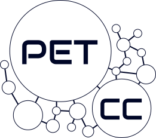

--- 
layout: home
title: Minicurso de Linux e Git
---

# {{ page.title }}

 

Bem vindo ao site oficial do Minicurso de Linux e Git ofertado pelo PET de Ciência da Computação.

O Minicurso será ofertado do perído de 05/08/2024 até 14/08/2024, e as aulas serão das 14h até as 18h, no
Departamento de Informática e Matemática Aplicada (DIMAp), UFRN, na sala Laboratório de Ensino.

Você pode consultar o material das aulas que foram ministradas até agora em [`/aulas`](/aulas.md) e saber mais sobre o Minicurso em geral em [`/sobre`](/sobre.md).



## Motivação do Curso

Fortemente inspirado em cursos como [**The Missing Semester of Your CS Education - MIT**](https://missing.csail.mit.edu/) e
[**Unix mini-course - IMD**](https://unix.imd.ufrn.br/) o nosso minicurso compartilha o mesmo ímpeto
de divulgar, ensinar e despertar o interesse de ferramentas e conceitos que são extremamente importantes
para a área de Computação, mas que muitas vezes não fazem parte da grade curricular de cursos desse campo.

## Programação do curso



---

&copy; PET-CC/UFRN 2024 Licenciado sob <a href="https://creativecommons.org/licenses/by-nc-sa/4.0/deed.pt-br">CC BY-NC-SA</a>.

