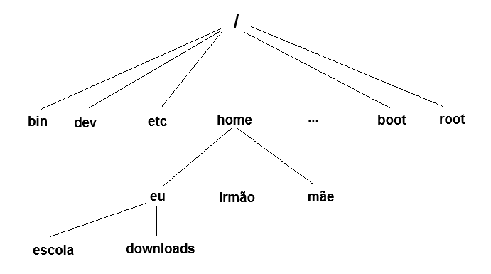

# Primeiros passos no Linux

<div id="sumario" class="sumario-oldschool">
    <h1>Sumário</h1>
    <ul>
    <li><a href="#introdução">Introdução</a>
      <ul>
        <li><a href="#o-que-é-o-linux">O que é o Linux?</a></li>
        <li><a href="#família-unix-e-unix-like">Família Unix e Unix-Like</a></li>
        <li><a href="#distros">Distros</a></li>
      </ul>
    </li>
    <li><a href="#uso-básico-do-shell">Uso básico do Shell</a>
      <ul>
        <li><a href="#intro">Intro</a></li>
        <li><a href="#primeiros-passos">Primeiros passos</a></li>
        <li><a href="#navegando-com-o-shell">Navegando com o Shell</a></li>
        <li><a href="#opções-e-argumentos-de-comando">Opções e argumentos de comando</a></li>
        <li><a href="#como-investigar-comandos">Como investigar comandos</a></li>
      </ul>
    </li>
    <li><a href="#permissões-leitura-e-busca-emde-arquivos">Permissões, leitura e busca em/de arquivos</a>
      <ul>
        <li><a href="#long-listing-format-e-permissões">Long listing format e permissões</a></li>
        <li><a href="#lendo-arquivos">Lendo arquivos</a></li>
      </ul>
    </li>
    <li><a href="#links-simbólicos-e-links-físicos">Links simbólicos e links físicos</a></li>
    <li><a href="#comandos-de-busca">Comandos de Busca</a>
      <ul>
        <li><a href="#find-imprime-arquivos-cujo-correspondem-a-um-padrão">`find` - Imprime arquivos cujo correspondem a um padrão</a></li>
        <li><a href="#grep-imprime-linhas-que-correspondem-a-um-padrão">`grep` - Imprime linhas que correspondem a um padrão</a></li>
      </ul>
    </li>
    <li><a href="#redirecionando-e-combinando-comandos">Redirecionando e combinando comandos</a>
      <ul>
        <li><a href="#standard-input-output-e-error">Standard Input, Output e Error</a></li>
        <li><a href="#redirecionando-o-standard-output-e-standard-error">Redirecionando o Standard Output e Standard Error</a></li>
        <li><a href="#redirecionando-o-standard-input-e-wildcards">Redirecionando o Standard Input e wildcards</a></li>
        <li><a href="#combinando-comandos">Combinando comandos</a></li>
        <li><a href="#operadores-lógicos-no-shell">Operadores lógicos no shell</a></li>
      </ul>
    </li>
    <li><a href="#exercícios">Exercícios</a></li>
  </ul>
  
  <button class="toggle-button" id="toggle-button">
  
      Esconder Sumário
  
  </button>
  
  
  </div>

## Introdução

### O que é o Linux?

O Linux não é um sistema operacional por si só, mas sim o que chamamos de um **kernel**, que num sentido mais literal representa um programa que controla os recursos do computador, permite que os usuários rodem programas, controlem os periféricos controlados e, também, provê um sistema de arquivos que gerencia o armazenamento a longo prazo de informação, como programas, dados e documentos.

Num sentido um pouco mais amplo, quando falamos "Linux", nos referimos a um combo chamado "GNU/Linux", onde "GNU" (**G**NU is **N**ot **U**nix; mais sobre o UNIX depois) é uma camada superficial do programa que corresponde a compiladores, editores de texto, programas etc.

Num sentido ainda mais amplo, quando falamos "GNU/Linux" ou apenas "Linux", falamos de uma família de sistemas os quais implementaram essa "interface" por assim dizer. Cada membro da familia é o que chamamos de distro Linux (mais sobre isso no futuro), que agora, de fato, é um sistema operacional completo, pois empacota o que é oferecido pelo Linux e GNU, e torna seu sistema utilizável sem que você tenha que compilar todas as dependências e montar seu sistema do absoluto zero.

Esses detalhes não são realmente importantes para esse curso, pois o nosso objetivo é apenas ensinar como se localizar, investigar e usar diversas ferramentas que são genéricas a uma família ainda maior de sistemas, chamados de "Unix-like", onde um dos herdeiros dessa família é o Linux.

### Família Unix e Unix-Like

Inicialmente, vamos falar um pouco sobre quem começou essa gigantesca família de sistemas chamadas Unix-Like. Era uma vez o Unix, um sistema operacional que foi desenvolvido no início dos anos 1970 como uma alternativa flexível e portátil aos sistemas da época, que eram grandes, caros e difíceis de manter, especialmente porque eram programados em linguagem de máquina específica para cada tipo de hardware. Sendo um dos primeiros sistemas operacionais escritos na linguagem C — possivelmente o primeiro —, o Unix se destacou pela adaptabilidade e facilidade de implementação em diferentes tipos de hardware. Apesar de ser um ótimo sistema para a época, o Unix foi construido para propósitos educaionais e sua licensa era muito cara, talvez por esse motivo ele não tenha sido muito atrativo para a população geral. Independentemente disso, ele trouxe inovações que estabeleceram um modelo e uma filosofia de desenvolvimento de software que ainda influencia inúmeras outras plataformas e sistemas operacionais subsequentes, como o MacOS, sistemas BSDs e os Linux. Esse conjunto de inovações e filosofia, futuramente estabeleceu até um padrão, que é o que chamamos de POSIX.

### Distros

#### Linux

Como foi dito anteriormente, Linux é apenas uma família de sistemas, e cada sistema é chamado de distro Linux. Existem uma série de diferenças entre essas distros, que dependem da implementação de quem os gerencia. Além disso, pelo GNU e o Linux serem "software livre" qualquer uso e implementação do Kernel Linux e do projeto GNU tem que ser gratuita e código aberto. Mas então, qual é a principal diferença entre essas distribuições?

As distros são coleções de software que incluem o kernel Linux, software GNU e, muitas vezes, outros pacotes que podem ser de outras origens. Estas distribuições são adaptadas para atender a diferentes tipos de usuários e podem incluir desde versões muito leves para hardware antigo até sistemas completamente equipados para uso corporativo. Algumas das mais populares são [Ubuntu](https://ubuntu.com/desktop), [Mint](https://linuxmint.com/), [Fedora](https://fedoraproject.org/), [Debian](https://www.debian.org/index.pt.html) e [Arch](https://archlinux.org/), cada uma oferece uma experiência de usuário diferente, ferramentas específicas e um sistema de gerenciador de pacotes que facilita a instalação e a manutenção de software.

#### BSD's

Ao lado das distribuições Linux, existem os sistemas operacionais [BSD](https://pt.wikipedia.org/wiki/Berkeley_Software_Distribution), que são outra família de sistemas Unix-like. BSD, que significa Berkeley Software Distribution, refere-se a uma série de distribuições de software que foram originalmente desenvolvidas e distribuídas pela Universidade da Califórnia em Berkeley. Assim como o Linux, os sistemas BSD têm um núcleo e ferramentas de usuário, mas são desenvolvidos e licenciados de maneira diferente. Exemplos notáveis de sistemas BSD incluem [FreeBSD](https://www.freebsd.org/), [NetBSD](https://www.netbsd.org/) e [OpenBSD](https://www.openbsd.org/).

Os sistemas BSD e as distribuições Linux compartilham muitas das filosofias básicas de sistemas Unix-like, mas cada família tem suas próprias comunidades, filosofias de desenvolvimento, e escolhas técnicas que os diferenciam significativamente.

## Uso básico do Shell

### Intro

Para entender um pouco melhor do que se trata o shell, note que na época em que o Unix se popularizou (final da década de 70 e início da de 80) não existia uma interface gráfica (GUI) e toda interação era feita via comandos com a ajuda de um terminal. Os caracteres inseridos no teclado eram enviados ao hardware, que enviava uma instrução ao software para que eles aparecessem na tela e o usuário pudesse ver o que estava digitando.

<div style="text-align: center;">

</div>

- *Imagem de um DEC VT100 rodando Unix (1978), fonte: <https://en.wikipedia.org/wiki/VT100>*

Essa linha de comando e interface de texto na época era única e exclusiva responsabilidade do Shell, que em síntese é um programa que interpreta a entrada do usuário e a repassa para o sistema, fazendo com que este gerencie o processo (comando) executado.

Atualmente, com o advento das interfaces gráficas, o Shell perdeu muito do seu papel de protagonista e hoje pode ser invocado a partir de o que chamamos de emulador de terminal. Entretanto, caso tenha resolvido não instalar e configurar uma interface gráfica (ao instalar o Arch, por exemplo), o Shell será seu único companheiro.

<div style="text-align: center;">

</div>

- *Imagem do emulador gnome-terminal rodando no ubuntu 24.04 LTS, fonte: <https://canaltech.com.br/linux/ubuntu-2404-lts-e-liberado-veja-as-principais-novidades-286919/>*

A maioria das distros linux vêm com o shell do projeto GNU, **B**ourne **A**gain **Sh**ell (Bash) pré instalado, não é um padrão e se você quiser, existem diversos outros que você pode instalar e utilizar. Quando o shell é iniciado, o usuário se depara com uma tela do seguinte tipo:

```terminal
[user@hostname ~]$
```

Vamos entender o que significa cada símbolo desse.

```terminal
[user@hostname ~]$
  ^      ^     ^ ^
  │      │     │ └─ O cifrão diz que você não é o usuário `root` (mais sobre isso depois)
  │      │     └── Seu «Working Directory», o diretório que o shell está operando no momento
  │      └── Nome do computador, também conhecido como o nome do host
  └── Nome do usuário que está usando o shell nessa sessão 
```

A maneira mais simples de usar o shell, é digitando comandos!.

### Primeiros passos

#### Comando `date` e `echo`

Agora que ja demos nosso primeiro comando, vamos conhecer mais alguns comandos legais, tente:

```terminal
[user@hostname ~]$ date
```

e

```terminal
[user@hostname ~]$ cal
```

Sem muitas surpresas deve ter aparecido a data e o horário de hoje, e um calendário do mês, agora vamos testar o seguinte comando com um argumento:

```terminal
[user@hostname ~]$ echo Hello 
                          ^
                          └─ Argumento passado para o programa (input)
```

Seu terminal provalvemente ficou assim:

```terminal
[user@hostname ~]$ echo Hello 
Hello
```

O programa `echo` apenas imprime o argumento que você passou para ele em uma *stream* (falaremos mais sobre no futuro).

Você também pode usar o `echo` das seguintes formas, teste e veja o resultado:

```terminal
[user@hostname ~]$ echo "Hello World"
```

```terminal
[user@hostname ~]$ echo Hello\ World
```

<!-- FIX: Não está muito boa essa parte, dar uma olhada --->

O que acabamos de presenciar aqui são **inputs** e **outputs** de um programa, o input é o argumento que você
deu para determinado programa e o output é a resposta que você recebeu.

Imagine que estamos de volta num restaurante sem botões e qr code. Aqui, o input é como fazer seu pedido ao
garçom, você pode especificar não apenas o prato que deseja, mas também detalhes como o ponto da carne,
ausência de algum ingrediente ao qual você é alérgico, ou até mesmo pedir acompanhamentos extras. Esse pedido,
ou comando, é passado ao garçom, que aqui atua como uma interface entre você (o usuário) e a cozinha (o
sistema operacional ou o programa em execução).

O output, por outro lado, é o prato que você recebe após a cozinha processar seu pedido. Assim como em um sistema de computador, o output depende diretamente do input: se você pedir uma pizza de calabresa, não receberá uma feijoada (provavelmente :P).

Teste digitar qualquer coisa no terminal e veja o que acontece.

```terminal
[user@hostname ~]$ ablueblauebluebalbbeu
```

Porque esse comando não faz sentido, o shell vai nos dizer que deu errado e vai nos dar outra chance:

```terminal
bash: ablueblauebluebalbbeu: command not found
[user@hostname ~]$
```

#### Histórico de comandos

Se você pressionar `↑`, o nosso comando `ablueblauebluebalbbeu` vai reaparecer para podermos usa-lo novamente, se você continuar pressionan. Isso é chamado de histórico de comandos e a maioria das distribuições Linux armazenam por padrão pelo menos os últimos 1000 comandos. Se você pressionar `↓`, você avança para o presente no histórico até o comando desaparecer.

### Navegando com o Shell

Que nem o Windows, um Unix-Like organiza seus arquivos no que é chamado de Estrutura de dirétorios hierárquica. Isso significa que é possível visualizar esse sistema como uma árvore de diretórios, também chamados de pastas. Esses diretórios funcionam exatamente como pastas de escritório que você pode ter em casa, onde cada uma pode ter outra pasta e/ou um arquivo, onde cada arquivo tem um nome, junto com informações extras como a quem ele pertence ou o quão grande ele é.

A principal diferença filosófica entre o sistema de arquivos fundado pelo Unix é que, ao contrário do Windows, que tem um arvóre de arquivos diferente para cada dispositivo de armazenamento, um Unix-like tem apenas uma árvore, que independe da quantidade de dispositivos de armazenamento conectados ao computador.

Além disso, vale ressaltar, que o sistema de arquivos não é capaz de diferenciar entre formatos diferentes de arquivo (`.pdf`, `.rar`, `.qualquercoisa`), ele não impõe nenhuma estrutura a ser seguida por esses arquivos, o significado dos bytes que ali estão sendo armazenados dependem única e exclusivamente dos programas que lidam e interpretam com esse arquivo. Isso não é apenas verdade para arquivos genéricos, mas também para caracteres digitados no seu teclado, dispositivos conectados e tudo que você pode imaginar.

Existem sim casos especiais de arquivo, como diretórios e links simbólicos (mais sobre no futuro), mas eles
não correspondem diretamente ao formato do arquivo, mas sim ao seu tipo.

<!---->
<div style="text-align: center;"> 
</div>
<br>

#### Current working directory

<!-- FIX: Inconscistência nos nomes nessa seção 
--->

O sistema de arquivos funciona como uma árvore: você possui um diretório de origem, o `/` (chamado de **root**) e os galhos acima dele, que são os outros diretórios do computador. A partir de um diretório, é possível ver os diretórios diretamente ligados a ele seja "descendo" ou "subindo" a árvore. Quando você acessa um diretório e passa a ter acesso a todos os arquivos dentro dele, aquele passa a ser seu **Working Directory**. Imagine que seu sistema de arquivos é a
seguinte árvore de cabeça para baixo.

<div style="text-align: center;">

</div>
<br>

Utilizando o comando `pwd`, que é uma sigla para **P**ath to **W**orking **D**irectory, é possível saber o caminho de todos os diretórios da root até o seu diretório atual:

```terminal
[eu@hostname ~]$ pwd
/home/eu
```

Além do working directory nós temos também o home directory, que é o único lugar que usuários comuns são autorizados a escrever em ou um arquivo. Para cada usuário é dado um home directory, ou seja por padrão você apenas capaz de ver outros diretórios além do seu, se quiser editar algo que não é seu, você precisará de algo que chamamos de permissões de superusuário, ou sudo (mais sobre isso no futuro).

#### Caminhos absolutos e caminhos relativos

Ao navegar pelo sistema utilizando o shell, geralmente utilizamos caminhos absolutos como o do exemplo anterior. Estando no diretório `/home/eu`, você pode utilizar o comando `cd` (que significa **C**hange **D**irectory) para acessar o diretório `/home`, da seguinte forma:

```terminal
[eu@hostname ~]$ cd /home
[eu@hostname home]$
```

> (Perceba o `~` mudando)

Porém, digamos que você está na pasta `/downloads` e deseja ir até a pasta `/escola` ! Para isso, é necessário se utilizar do **caminho relativo** `..`

Os dois pontos representam o **diretório anterior** de forma relativa, e podem ser utilizados para *voltar* enquanto navegando pelo sistema de arquivos:

```terminal
[eu@hostname downloads]$ cd ..
[eu@hostname ~]$ cd escola
[eu@hostname escola]$
```

Também temos o caminho relativo `.` que representa o **diretório atual**. Na parte de navegação de arquivos esse caminho não é tão interessante, mas é crucial quando estamos tratando de **executar comandos**.

#### Listando, criando diretórios e arquivos

Podemos manipular diretórios e arquivos a partir de comandos:

Usando o comando `mkdir` (de Make Directory), é possível criar uma nova pasta. A sintaxe do comando é: `mkdir <nome_da_pasta>`. Digamos que você acabou de criar na pasta `escola` a pasta `minicurso_linux_git`:

```terminal
[user@hostname escola]$ mkdir minicurso_linux_git
[user@hostname escola]$ cd minicurso_linux_git
[user@hostname minicurso_linux_git]$
```

Vamos adicionar também um arquivo de texto para anotações da aula, usando o comando `touch`
(Divine **touch**):

```terminal
[user@hostname minicurso_linux_git]$ touch anotacoes.txt
```

Você criou essa pasta assim que chegou em casa, logo após a primeira aula do minicurso. Você colocou na pasta esse arquivo de texto com as anotações da aula e um arquivo de imagem, com uma *selfie* que você tirou com um colega no dia da aula.

 Um tempo se passou, você já se formou na faculdade e você encontra esse diretório novamente, você se pergunta, qual o conteúdo dele?

Com o comando `ls` (**L**i**s**t), é possível listar todo o conteúdo de um diretório:

```terminal
[user@hostname minicurso_linux_git]$ ls
anotacoes.txt  foto-do-quadro.jpg  
```

Porém, você está trocando de computador e o computador no qual essa pasta foi criada não será mais utilizado. Ainda muito saudoso pelo seu tempo de novato nesse mundo do Linux, você decide levar o conteúdo dessa pasta para o seu novo computador. Você copia os arquivos para um *pen-drive* usando o comando `cp` (**C**o**P**y)):

```terminal
[user@hostname minicurso_linux_git]$ cd ..
[user@hostname ~]$ cp minicurso_linux_git pen-drive
```

e então decide removê-la, utilizando o comando `rm` (**R**e**M**ove), você deleta cada arquivo:

```terminal
[user@hostname ~]$ cd minicurso_linux_git
[user@hostname minicurso_linux_git]$ rm anotacoes.txt foto-do-quadro.jpg
[user@hostname minicurso_linux_git]$ ls
```

E agora, não resta mais nenhum arquivo na pasta e você pode finalmente removê-la com o comando `rmdir` (**R**e**M**ove **DIR**ectory).

```terminal
[user@hostname minicurso_linux_git]$ cd ..
[user@hostname ~]$ rmdir minicurso_linux_git
```

E... pronto! A pasta agora não existe mais no computador, e você está pronto para iniciar um novo ciclo.

### Opções e argumentos de comando

#### Filosofia Unix: Programas simples e combináveis

No Linux, e mais geralmente, no próprio Unix, cada programa e comando segue a filosofia de cumprir um
único propósito e cumprir bem esse propósito, e cabe ao próprio usuário combinar esses comandos para
realizar a tarefa que ele deseja. Por exemplo, não faria sentido um comando específico para mandar um
email, que ao mesmo tempo encomenda um tênis no varejo (se isso é uma necessidade específica sua). É muito
mais prático, e faz muito mais sentido existir um programa que envia emails e um que encomenda coisas na
internet, visto que, diversos usuários vão usar o sistema de maneiras diferentes.

Mas também, seria interessante que seu programa mudasse ligeiramente
seu comportamento padrão para se moldar a uma necessidade que não foge necessáriamente do próposito principal
do comando. Pois, talvez você só quissese mandar um email para uma pessoa diferente ou para múltiplas pessoas,
seu  próposito inicial (mandar um email) não mudou, mas o comportamento do programa sim. Nesse sentido, é
conveniente para nós usuários e programadores, mudar ligeiramente o que o nosso comando faz, por isso urge
a necessidade de opções de comando.

##### Excerto dessa filosofia

- Todo programa deve fazer UMA coisa bem.
- Esperar que a saída desse programa seja a entrada de outro, mesmo que esse seja desconhecido.

#### Opções de comando

No tópico anterior executamos uma sequência indiscriminada de comandos para realizar uma tarefa relativamente simples.
Mas mesmo, assim executamos diversos passos só para remover todos os arquivos de uma pasta para depois removê-la por
completo, então, talvez seja conveniente para você usar o `rm` (remove) para remover tudo logo de uma vez sem mais nem menos. E ele, de fato tem uma opção que faz isso, e você pode invocar essa opção da seguinte maneira:

```terminal
[user@hostname ~]$ rm --recursive minicurso_linux_git
                      ^
                      └ Todos (99.8%) dos comandos do unix começam com um '-' antes da opção
```

Assim seu programa já vai deletar a pasta por inteiro, independente de ter arquivos dentro ou não. Além disso, existe uma certa
tendência de nós programadores querermos gastar pouca tinta em tudo que a gente escreve, então (90%) das opções que a gente mais
usa tem uma abreviação, nesse caso, a abreviação é `-r`.

##### Opções de comando do `ls`

Essas opções váriam de comando para comando, então que tal explorar algumas opções de comando que existem para, provavelmente, o comando mais customisável  que temos. O `ls`.

Teste o comando `ls` com a opção `-F` (abreviação para `--classify`), que especifica o tipo de cada arquivo listado:

```terminal
[user@hostname ~]$ ls -F
escola/ downloads/ Minecraft* 'Pequeno Príncipe.pdf'
```

A opção `-F` decora o `ls` com esses símbolos para que possamos saber que tipo de
arquivo estamos vendo, isto é, o `/` é para diretórios, `*` é para arquivos
executáveis e o `@` são links para outros arquivos (ou atalhos, mais sobre
isso no futuro).

#### Parênteses sobre dotfiles

Outra opção que usamos muito em conjunto com o `ls` é a opção `-a/--all`,
que lista os arquivos "ocultos" do seu computador, conhecidos mais comumente
como *dotfiles*. São chamados assim por começarem com um `.` no início do nome. Para descobrir o que são *dotfiles* tente, por exemplo, rodar o comando `ls` primeiro sem e depois com a opção `-a/--all` no seu *home directory*.

```terminal
[user@hostname ~]$ ls ~
```

```terminal
[user@hostname ~]$ ls -a ~
```

Provavelmente deve ter aparecido milhões mais arquivos e diretórios, e provavelmente todos começam com `.`, inclusive os diretórios especiais `.` e `..`, se quiser ver mais detalhadamente as diferenças teste o comando `diff` com as seguintes opções:

```sh
diff --color=auto <(ls) <(ls -a)
```

### Como investigar comandos

A gente já explorou e aprendeu um belo punhado de comandos e opções, e conforme formos aprendendo mais, vai se tornar impraticável lembrar de todos. Por isso
O Linux vem com ferramentas que podem ser utilizadas quando se quer saber mais sobre um comando, sem ter que depender da internet ou magos da computação toda hora.
Logo, podemos consultar o comportamento e a documentação de um comando usando o `man` (**MAN**ual). Até para comandos mais simples, há uma quantidade absurda de informação, mas não se desespere, vamos dar uma olhada em cada parte do manual:

<pre>
    <code>
LS(1)                                User Commands                                     LS(1)

<span style="text-decoration: underline; text-decoration-color: red;">NAME</span> <span style="color: red;">Essa seção mostra o nome do comando e diz brevemente o que ele faz</span>
       ls - list directory contents

<span style="text-decoration: underline; text-decoration-color: yellow;">SYNOPSIS</span> <span style="color: yellow;">Essa seção mostra como se usa o comando</span>
       ls <span style="color: yellow">[</span>OPTION<span style="color: yellow">]...</span> [FILE]...
       <span style="color: yellow">Os colchetes nos dizem que determinado argumento é opcional, e os pontinhos dizem que
       podem ser diversos argumentos. Nesse caso, ele está dizendo que pode receber várias
       opções e arquivos</span>

<span style="text-decoration: underline; text-decoration-color: blue;">DESCRIPTION</span> <span style="color: blue">Essa seção mostra uma descrição detalhada do programa e quais são as opções dele</span>
       List information about the FILEs (the current directory by default).  
       Sort entries alphabetically if none of -cftuvSUX nor --sort is specified.

       Mandatory arguments to long options are mandatory for short options too.

       -a, --all
              do not ignore entries starting with .

       -A, --almost-all
              do not list implied . and ..
...

       -F, --classify[=WHEN]
              append indicator (one of */=>@|) to entries WHEN
...
    </code>
</pre>

O manual de um comando tem tudo que é necessário para se entender como um comando funciona e como ele pode se utilizado.
Portanto, é muito importante se familiarizar com sua interface e sempre recorrer a ele quando estivermos querendo aprender
algo novo, apesar de as vezes ser difícil de entender... (a galera que escreveu não é lá muito pedagógica :P).

## Permissões, leitura e busca em/de arquivos

### Long listing format e permissões

Continuando nossa exploração, uma opção muito utilizada com o comando `ls` é o `-l`
(**L**ong listing format), que lista uma série de informações extra sobre o conteúdo
de um diretório. Vejamos um exemplo:

```terminal
[user@hostname ~]
total 28
drwxr-xr-x 7 user user 4096 Jun 28 07:32 escola
drwxr-xr-x 5 user user 4096 Jun 28 09:33 downloads
-rwxr-xr-x 1 user user 4096 May 15 19:35 Minecraft
-rwxr-xr-x 1 user user   69 Jun 10 19:23 'Pequeno Príncipe.epub'
```

Onde, por exemplo:

<pre>
<code>
<b>d</b><span style="color: yellow">rwx</span><span style="color: red;">r-x</span><span style="color: blue;">r-x</span> <span style="color: green;">5</span> <span style="color: orange;">user </span><span style="color: aquamarine;">user </span><span style="color: brown;">4096 </span><span style="color: magenta;">Jun 28 09:33</span> downloads
</code>
</pre>

Corresponde a:

  <table>
        <thead>
            <tr>
                <th>Campo</th>
                <th>Significado</th>
            </tr>
        </thead>
        <tbody>
            <tr>
                <td>downloads</td>
                <td>nome do arquivo</td>
            </tr>
            <tr>
                <td><span style="color: magenta;">Jun 28 09:33</span></td>
                <td>Última modificação</td>
            </tr>
            <tr>
                <td><span style="color: brown;">4096</span></td>
                <td>	O tamanho do arquivo em bytes</td>
            </tr>
               <tr>
                <td><span style="color: cyan;">user</span></td>
                <td>O grupo de usuário ao qual o arquivo pertence</td>
            </tr>
               <tr>
                <td><span style="color: orange">user</span> </td>
                <td>O dono do arquivo</td>
            </tr>
               <tr>
                <td><span style="color: green;">5</span> </td>
                <td>O número de hardlinks (mais sobre isso no futuro)</td>
            </tr>
               <tr>
                <td><b>d</b><span style="color: yellow">rwx</span><span style="color: red;">r-x</span><span style="color: blue;">r-x</span></td>
                <td>As permissões de acesso do arquivo e o tipo do arquivo</td>
            </tr>
        </tbody>
    </table>

- As permissões de acesso e o tipo de arquivo em detalhes:
  - O tipo do arquivo: **d** (directory).
  - As permissões do usuário atual: <span style="color: yellow">rwx</span>.
  - As permissões do grupo de usuário: <span style="color: red;">r-x</span>.
  - As permissões de outros usuários: <span style="color: blue;">r-x</span>.

O Linux possui um sistema de permissões separadas por três categorias: permissão de escrita (`w`), permissão de leitura (`r`) e permissão de execução (`x`).

Dependendo do seu tipo de usuário, você pode ter mais ou menos permissões. No caso do `ls -l`, temos os três tipos:

- Autor do arquivo, Grupo do arquivo e outros.

Intuitivamente, quem costuma ter mais permissões sobre um arquivo é o seu autor, e quem costuma ter menos permissões é outros usuários. Vamos dizer por exemplo que exista um grupo de programadores trabalhando em um projeto, sendo um desses programadores o autor.

O autor será responsável por testar a aplicação principal do projeto, portanto ele terá as permissões **w**, **r** e **x** (escrita, leitura e execução).

Os programadores precisam se preocupar apenas com o desenvolvimento do projeto, portanto terão as permissões **w** e **r** (escrita e leitura).

Já o usuário genérico pode apenas ver projeto, pois ele ainda não está terminado, logo ele possui a permissão **r** (leitura), apenas.

Agora que entendemos a ideia geral das permissões no Linux, vamos a um conceito que será muito utilizado em toda sua trajetória nesse sistema: o **super usuário**.

O conceito de super usuário, ou root, no Linux é muito semelhante ao conceito de administrador no Windows. Você utiliza do super usuário para realizar mudanças no sistema como instalar arquivos, mudar permissões, etc. Entretanto, o usuário root deve ser usado pontualmente, pois o uso indevido pode danificar o sistema de diversas formas, justamente por não ter permissões para pará-lo. Você pode utilizar um comando como super usuário utilizando o prefixo `sudo` (que significa **S**uper **U**ser **Do**), porém é necessário saber a senha do computador.

### Lendo arquivos

#### Lendo o conteúdo de arquivos de texto

Até o momento aprendemos diversas ferramentas relacionadas a manipulação de arquivos, sabemos criar,
deletar, copiar e deletar até mesmo modificar o comportamento dos comandos. Logo, é dada hora de
finalmente ler os nossos arquivos.

E para cumprir tal objetivo, existem muitas oções já pré-instaladas que tem seu próprio uso.
Vamos explorar algumas:

(Sinta-se convidado(a) a pular a explicação de cada um e já olhar direto no manual ;))

- Comando `cat` (con**CAT**enate):

O comando cat lê um ou mais arquivos e copia o conteúdo deles para o output padrão.

```
 cat [OPTION]... [FILE]...
```

Note que se você tentar em um arquivo muito grande, você não vai ser capaz de ler tudo sem scrollar
manualmente usando o mouse.

- Comando `less`  e `more` (**Less** is **More**):

O `less` foi desenvolvido para ser uma substituição do antigo programa do Unix chamado `more`. Ambos fazem
a mesma coisa, e eles caem na categoria que chamamos de *pagers*, que são programas que permitem uma melhor
visualização de longos documentos de texto em contrapartida com o `cat` que não lhe mostra muito.

```
less [options] file ...
```

- Comando `head` and `tail`:

As vezes não queremos toda informação de um arquivo, talvez as primeiras ou últimas linhas de um arquivo
já bastam dependendo da necessidade. Nesse sentido, o `head` e o `tail` servem exatamente para esse
próposito, onde por padrão eles exibem as primeiras 10 e últimas linhas de um arquivo, respectivamente.

```
head [OPTION]... [FILE]...
```

```
tail [OPTION]... [FILE]...
```

A quantidade de linhas que ele vai exibir pode ser ajustada com a opção `-n/-lines=[-]`.

## Links simbólicos e links físicos

### Links simbólicos (sym-links)

Enquanto nós exploramos o sistema, é bem provável se deparar com a seguinte listagem de diretório (por exemplo, `ls -l /lib`):

```terminal
lrwxrwxrwx 1 root root 7 Apr  7 15:02 /lib -> usr/lib
```

Note como a primeira letra da listagem é 'l' e o arquivo parece ter dois nomes? Isso é um caso especial do
que chamamos de link simbólico, no windows é equivalente ao que chamamos de atalho e funciona exatamente
do mesmo jeito. A utilidade disso agora parece ser dúbia, mas você não imagina o quanto pode ser útil,
principalmente no que diz respeito a instalação de programas (mais sobre isso no futuro).

Você pode criar um sym-link para seu arquivo favorito da seguinte forma

```
ln -s <alvo> <link>
```

Se você apagar o link que você criou, o alvo persistirá intacto, mas se você apagar o arquivo original, o
seu link vai ficar inutilizado.

### Links físicos (hard-links)

Os hard-links, eram uma alternativa mais antiga que surgiu lá nos primeiros Unix, e eles tem uma série de
restrições comparadas ao sym-links. Dentre as quais:

- Os hard-links são indistinguíves do arquivo original, isto é, se você apagar um você apaga o outro.
- Um hard-link não pode referenciar um diretório.

As boas práticas de hoje em dia, tendêm a preferir o uso de sym-links, então fique atento(a)! Você pode
criar um hard-link da seguinte maneira:

```
ln <alvo> <link>
```

## Comandos de Busca

### `find` - Imprime arquivos cujo correspondem a um padrão

Agora que você já sabe navegar no seu sistema com `cd`, `ls`, `pwd` e etc, quero lhe convidar a aprender
a usar mais um comando que pode ser muito útil na sua navegação e em diversas outras aplicações.
Imagine que você esqueceu onde estáva seu diretório com todas as suas atividades deste minicurso, mas
ao menos você lembra que o nome desse diretório era com "minicurso_linux_git", o comando `find` é uma
solução para esse e outros tipos de problema e você pode usá-lo da seguinte forma:

```
find [starting-point...] [expression]
```

```sh
# Procura todos os diretórios nomeados minicurso_linux_git
find . -name minicurso_linux_git -type d
```

Note que a expressão que você está procurando é opcional, então se você usar apenas `find` ele vai listar
loucamente todos os arquivos de todas as pastas a partir do seu diretório atual (teste!).

### `grep` - Imprime linhas que correspondem a um padrão

Encontrar arquivos pelo nome pode ser muito útil, mas imagine que além de estar procurando o arquivo, você
está procurando por alguma linha específica nesse arquivo, por exemplo, um arquivo de código gigantesco de
10 mil linhas e você precisa achar quando uma váriavél foi declarada. Você pode usar o `grep` da seguinte forma:  

```
grep [OPTION...] PATTERNS [FILE...]
```

Algumas opções úteis do `grep` são:

- `-i`, diz para o `grep` ignorar a diferença entre letras maiúsculas e minúsculas.
- `-v`, diz para o `grep` imprimir apenas aquelas linhas que não correspondem ao padrão.

## Redirecionando e combinando comandos

### Standard Input, Output e Error

A maioria dos programas que usamos até agora produzem uma saída (output) de algum tipo. E essa saída
geralmente consiste em dois tipos:

- O resultado do programa, o que era esperado ele fazer.
- Mensagens de error, ou mensagens descritivas sobre algo que ele fez ou está fazendo.

[Relembrando um dos mantras do Unix em que "tudo é arquivo"](#navegando-com-o-shell), programas como o `ls` na verdade mandam seus
resultados para um tipo especial de arquivo chamado ***standard output*** (também conhecido como *stdout*)
e sua mensagem de error para outro tipo especial de arquivo chamado ***standard error*** (*stderr*). Por
padrão tanto ou *stdout* quanto o *stderr* são associados a janela do seu programa e não são salvos no seu disco.

Além disso, a maioria dos programas recebem entrada de outro tipo especial de arquivo chamado ***standard input*** (*stdin*), que é associado ao arquivo seu teclado.

### Redirecionando o Standard Output e Standard Error

[Lembra do que eu falei sobre a filosofia do unix?](#filosofia-unix-programas-simples-e-combináveis).
Naturalmente, podemos mudar um pouco o comportamento do *standard output* e *error* e mandá-los para
outro arquivo sem ser o seu terminal, para fazer isso, basta usar o operador `>` seguido pelo nome do
arquivo. Por exemplo:

- Para redirecionar a *stdout*:

```sh
ls -l /usr/bin > ls-output.txt
```

Note que se o `ls` emitir erros, eles vão continuar imprimindo na tela, tente:

```sh
ls -l /bin/usr > ls-output.txt
```

- Para redirecionar a *stderr*:

```sh
ls -l /usr/bin 2> ls-error.txt
```

Ao fazer isso o sistema automaticamente cria o arquivo, se não existir, e se existir, ele é sobrescrito.
Mas e se não quisermos que nosso arquivo seja sobrescrito?

Podemos usar o operador `>>` para anexar a saída do programa ao final do arquivo. Fazemos isso da seguinte maneira:

```sh
ls -l /usr/bin >> ls-output.txt
```

---

**Ainda não acredita que é tudo arquivo?**

Digite `tty` no seu terminal, esse comando vai te retornar o arquivo do seu terminal atual que está
associado ao *stdin* (o *stdout* e *stderr* também) são associados a esse mesmo arquivo por padrão.
Abra outro terminal e redirecione a saída do `date` para o endereço do arquivo dado pelo comando `tty`.

---

### Redirecionando o Standard Input e wildcards

[Lembra do `cat`?](#lendo-o-conteúdo-de-arquivos-de-texto), ele geralmente é usado para mostrar o
conteúdo de pequenos arquivos de texto. Mas como ele aceita mais de um arquivo como argumento, ele também
é usado para juntar o conteúdo de diversos arquivos. Imagine agora, que você anda escrevendo um livro
em que o conteúdo dele é separado em diversos arquivos por exemplo:

```
capitulo.1.1
capitulo.1.2
capitulo.2.2
⋮
capitulo.15.3
```

Você pode juntar o conteúdo de todos os arquivos, numa versão completa do livro assim:

```sh
cat capitulo* > meulivro.pdf
```

Assim como o `>` esse asterisco (`*`) é interpretado e expandido pelo shell, e informalmente é como se você dissesse para ele "cateia" tudo que começa "capitulo" e manda isso pro "meulivro.pdf". Esse asterisco é o
que chamamos de wildcard (ou cartas coringa), e você pode usar em qualquer parte da sua entrada se quiser e
pode usar mais de um, por exemplo:

```sh
ls Do*n*
```

(Se você tiver a pasta Downloads e Documentos no seu computador, o `ls` vai listar as duas)

Tá, mas o que isso tem a ver com o redirecionamento do *stdin*?

E se você tentar o `cat` sem argumentos? A princípio parece que nada acontece, mas ele está fazendo
exatamente o que é suposto a fazer.

Se você usar o `cat` sem argumentos, ele lê do *stdin*, visto que o *stdin* é associado por padrão ao seu
teclado, e está esperando a gente digitar alguma coisa! Adicione algum texto e pressione \<Enter>.

```terminal
[user@hostname ~]$ cat
O sábia não sabia que o sábio sabia que o sabiá não sabia assobiar ⏎
O sábia não sabia que o sábio sabia que o sabiá não sabia assobiar 
```

Agora, tecle \<Ctrl-d> (segure a tecla Ctrl e aperte "d") para dizer para o `cat` que você chegou no
fim do arquivo (**E**nd **O**f **F**ile - EOF) no *standard input*. Como o *standard output* também é o
terminal pro padrão, o `cat` apenas copia os o *stdin* para o *stdout*. A gente pode usar comportamento
para escrever coisas num arquivo, por exemplo:

```terminal
[user@hostname ~]$ cat > sabiá.txt
O sábia não sabia que o sábio sabia que o sabiá não sabia assobiar ⏎
```

(Não esqueça do \<Ctrl-d>!)

---

**Exercício!**

Qual a diferença entre `cat sabiá.txt` e `cat < sabiá.txt`?

---

### Combinando comandos

#### Combinando comandos com o redirecionamento de arquivos

#### Combinando comandos usando pipelines

### Operadores lógicos no shell

#### Curto circuito de operadores

<!--
    - TODO: Combinando comandos usando redirecionamento de arquivos
    - TODO: Combinando comandos usnado Pipelines `|`
    - TODO: Disjunção `||` e conjunção `&&`
    - TODO: Curto circuito de operadores
-->
## Exercícios

### Exercícios de fixação

#### Questão 1

 1. Para este curso, você precisa usar um shell Unix, como Bash, ZSH ou Fish. Para garantir que você está executando um shell adequado, tente o comando `echo $SHELL`. Se aparecer algo como `/bin/bash`, `/usr/bin/zsh` ou `usr/bin/fish`, significa que você está usando o programa certo.
 2. Crie um novo diretório chamado `petcc` em `/tmp`.
 3. Pesquise sobre o programa `touch`. O programa `man` é seu amigo.
 4. Use o `touch` para criar um novo arquivo chamado `dimap` em `petcc`.
 5. Escreva o seguinte nesse arquivo, uma linha de cada vez:

    ```sh
    #!/bin/sh
    curl --head --silent https://missing.csail.mit.edu
    ```

 6. Tente executar o arquivo, ou seja, digite o caminho para o script (`./dimap`) no seu shell e pressione Enter. Entenda por que não funciona consultando a saída de `ls` (dica: olhe para os bits de permissão do arquivo).
 7. Execute o comando iniciando explicitamente o interpretador `terminal` e fornecendo o arquivo `dimap` como o primeiro argumento, ou seja, `terminal dimap`. Por que isso funciona enquanto `./dimap` não funcionou?
 8. Pesquise sobre o programa `chmod` (por exemplo, use `man chmod`).
 9. Use `chmod` para possibilitar a execução do comando `./dimap` em vez de ter que digitar `terminal dimap`. Como o shell sabe que o arquivo deve ser interpretado usando `terminal`? Veja esta página sobre a linha [shebang](https://pt.wikipedia.org/wiki/Shebang_(Unix)) para mais informações.
 10. Use `|` e `>` para gravar a data de "last-modified" obtida pelo `dimap` em um arquivo chamado `last-modified.txt` no seu `/home/`.

 > Exercício retirado do curso `./missing-semester`

#### Questão 2

1. Use o comando `find` para listar todos os arquivos em `/var/log` que terminam com `.log`.
2. Redirecione o output desse comando para um arquivo com nome de `logs_found.txt` em `/tmp/petcc`.
3. Investigue o `grep` usando o `man` para descobrir uma forma de listar todas as ocorrências da palavra "error" dos arquivos que terminam com `.log` em `/var/log`.
4. Redirecione o output desse comando para um outro arquivo com o nome de `errors_found.txt`, também em `/tmp/petcc`.
4. No diretório `/tmp/petcc`, crie um arquivo chamado `log_monitor.sh`.
5. Adicione linha por linha o seguinte conteúdo:

    ```bash
    #!/bin/bash
    echo "Monitorando logs do sistema..."
    ```

6. Use os comandos que descobriu para preencher o script da seguinte forma:

    ```bash
    # ... O que já tinha ...
    echo "Listando logs em /tmp/petcc/logs_found.txt"
    # Comando usando find
    echo "Listando erros encontrados em /tmp/petcc/errors_found.txt"
    # Comando usando grep
    echo -n "Quantidade de erros encontrados: " 
    ```

7. Por último, investigue o comando `wc` usando o `man`.
8. Adicione uma última linha no script, que exibe a quantidade de erros que o `grep` encontrou.

### Exercícios Obrigatórios

#### Questão 0 (Dificuldade: Fácil)

1. Crie o diretório `/tmp/petcc`.

2. Dentro desse diretório, crie a pasta `exercícios`.

Para cada exercício, a partir desse, crie uma pasta para tal com o nome que preferir, mas que seja ordenado em ordem léxicográfica. Exemplo:

```
ex001
ex002
⋮
```

Dentro dos diretórios crie os arquivos necessários.

#### Questão 1 (Dificuldade: Fácil)

1. Crie um diretório, com o nome que preferir, dentro desse diretório, crie três arquivos e três pastas com quaisquer nomes contendo números. Em seguida, coloque o arquivo com menor número dentro da pasta com menor número e assim em diante.
2. Escreva a sequência de comandos usada no arquivo `/tmp/petcc/ex002/answer.sh`.

#### Questão 2 (Dificuldade: Fácil)

1. Crie um diretório chamado `mydir`.
2. Dentro desse diretório, crie um arquivo chamado `mytext.txt`.
3. Use o comando `echo` para adicionar a frase "Hello, World!" ao arquivo `mytext.txt`.
4. Use o comando `cat` para exibir o conteúdo do arquio `mytext.txt`.
5. Use o comando `cp` para copiar o arquivo `mytext.txt` para um novo arquivo chamado `mytext_copy.txt`.
6. Use o comando `rm` para remover o arquivo `mytext.txt`.
7. Verifique se o arquivo `mytext.txt` foi removido usando o comando `ls`.
8. Escreva a sequência de comandos usada no arquivo `/tmp/petcc/ex002/resposta.sh`.

#### Questão 3 (Dificuldade: Média)

1. Em uma linha digite a combinação de comando que cria um diretório chamado `myfolder` em `/tmp` e, somente se esse diretório tenha sido criado com sucesso, crie um arquivo chamado `myinfo.txt`.
3. Escreva essa linha de comando no arquivo `/tmp/petcc/ex003/resposta.sh`

#### Questão 4 (Dificuldade: Média)

1. Use o comando `find` para listar todos os arquivos em `/usr/bin` que começam com `g`.
2. Redirecione a saída desse comando para um arquivo chamado `g_files.txt` em `/tmp/mydir`.
3. Use o comando `grep` para encontrar todas as ocorrências da palavra "get" nos arquivos em `/usr/bin`.
4. Redirecione a saída desse comando para um arquivo chamado `get_occurrences.txt` em `/tmp/petcc/ex004`.
5. Digite a sequência de comandos usada no arquivo `/tmp/petcc/ex004/resposta.sh`

#### Questão 5 (Dificuldade: Média)

1. Copie os arquivos de todos os exercícios para o um diretório dentro de `/tmp/petcc/ex005`.
2. Tente deletar o diretório que você criou com `rmdir`.
3. Por quê não deu certo? Investigue o manual (`man`) e descubra a resposta.
    > Dica: dê uma olhada no comando `rm`.
4. Use o `echo` para redirecionar a resposta para o arquivo de texto chamado `/tmp/petcc/ex004/resposta.sh`.
5. Delete o diretório que você criou inicialmente.

#### Questão 6 (Dificuldade: Média)

1. No diretório `/tmp/petcc`, crie um arquivo chamado `sys_info.sh`.
2. Adicione o seguinte conteúdo ao arquivo `sys_info.sh`, uma linha de cada vez:

```bash
#!/bin/bash
echo "Informações do Sistema:"
uname -a
df -h
free -m
```

3. Use chmod para tornar o arquivo sistema_info.sh executável.
4. Execute o comando novamente digitando `./sys_info.sh` e pressione Enter.
5. Pesquise sobre os comandos `uname`, `df` e `free` utilizando o programa `man`.
6. Adicione um comentário explicativo para cada comando no arquivo `resposta.txt`para descrever o que cada um faz.
7. Execute o script novamente para verificar se tudo está funcionando conforme esperado.
8. Crie um link simbólico do arquivo `sys_info.sh` para o diretório `/usr/local/bin` e tente executá-lo de outro lugar apenas com `sys_info.sh`.

#### Questão 7 (Dificuldade: Difícil)

Em programas em C que envolvem muitos arquivos é comum querermos configurar nosso projeto de uma determinada maneira que fique fácil gerenciar multiplos arquivos. Entretanto, como você gosta de iniciar muitos projetos, você não quer precisar criar, repetidas vezes, arquivos que sempre vão estar no seu projeto. Por isso vamos criar um programa que automatize isso.

Imagine que você sempre organiza seu projeto baseado nessa estrutura.

```
.
├── build
├── test
├── lib
│   └── text_color.h
├── src
│   ├── include
│   │   └── header.h
│   └── main.c
├── CMakeLists.txt
├── LICENSE
└── README.md
```

1. No diretório `/tmp/petcc/ex006`, crie o arquivo `c_project_cfg.sh`.
2. Dentro desse arquivo, adicione a seguinte linha.

    ```bash
    #!/bin/bash
    ```

3. Após essa linha anexe os comandos necessários para criar a estrutura do projeto acima.
Seu arquivo no final deve ficar assim:

    ```bash
    #!/bin/bash
    # Comando 1
    # Comando 2
    # Comando 3
    ```

4. Para escrever linhas no arquivo use apenas comandos de redirecionamento, escreva quais foram esses comandos no `/tmp/petcc/ex006/answer.txt`
