# Git avançado

<div id="sumario" class="sumario-oldschool">
    <h1>Sumário</h1>
    <summary><a href="#git-avancado">Git avançado</a></summary>
    <ul>
      <li>
        <details>
          <summary><a href="#desfazendo-alteracoes">Desfazendo alterações</a></summary>
          <ul>
            <li><a href="#desfazendo-commits-sem-ter-publicado">Desfazendo commits sem ter publicado</a></li>
          </ul>
        </details>
      </li>
      <li>
        <details>
          <summary><a href="#workflow-avancado">Workflow avançado</a></summary>
          <ul>
            <li><a href="#git-branching">Git branching</a></li>
          </ul>
        </details>
      </li>
      <li>
        <details>
          <summary><a href="#git-merging">Git merging</a></summary>
          <ul>
            <li><a href="#fast-forward-merge">Fast-forward merge</a></li>
            <li><a href="#three-way-merge">Three-way merge</a></li>
            <li><a href="#lidando-com-conflitos">Lidando com conflitos</a></li>
          </ul>
        </details>
      </li>
      <li><a href="#projeto-pt1">Projeto pt.1</a></li>
    </ul>
  <button class="toggle-button" id="toggle-button">
  
      Esconder Sumário
  
  </button>
  </div>
## Desfazendo alterações

No [último tópico](/terceiroDia.md), tivemos o nosso primeiro contato com o `git`, e aprendemos a criar
repositórios para nos ajudar a rastrear as alterações feitas no nosso projeto localmente e remotamente.
Entretanto, durante o desenvolvimento de um projeto, não é incomum cometer erros ou fazer alterações
indesejáveis. Por exemplo, alterar um arquivo sem querer, ou adicionar um arquivo que não deveria ser
adicionado, ou até mesmo fazer um commit com uma mensagem errada.

Além disso, quando ainda estamos desenvolvendo certa maturidade em relação ao uso do `git` é muito comum
tomar medidas extremas, para solucionar diferentes tipos de problemas, sem de fato usar os meios que a
ferramenta nos oferece. Por exemplo, quem nunca deletou e baixou o repositório novamente para se livrar de
um simples `commit` errado?

Por isso, gostaria de apresentar algumas formas seguras e mais "elegantes" de lidar com alguns tipos de
problemas que podem surgir durante o desenvolvimento de um projeto.

### Desfazendo *commits* sem ter publicado

Imagine, por exemplo, que você tem um repositório com seguinte histórico de commits:

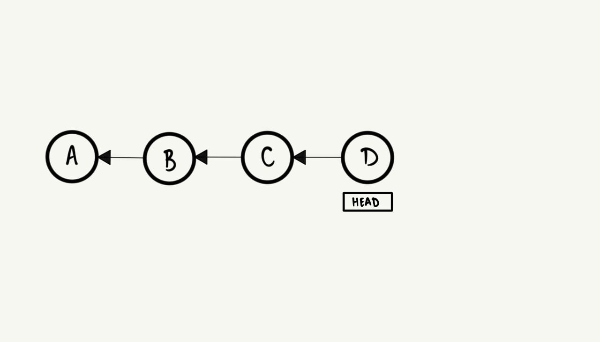
<br>

Você estava desenvolvendo a funcionalidade `E`, e agora é momento de finalmente fazer o *commit* e salvar
essa mudança:

```terminal
$ git status
On branch main
Untracked files:
  (use "git add <file>..." to include in what will be committed)
 E

nothing added to commit but untracked files present (use "git add" to track)

$ git add E ; git commit -m R
[main 0156e00] R
 1 file changed, 0 insertions(+), 0 deletions(-)
 create mode 100644 E
```

Porém, imediatamente após fazer o *commit*, você percebe que cometeu um erro e que o nome do commit na
verdade deveria ser "E" ao invés de "R". E agora, o que fazer?

Revisitando o nosso histórico de commits (podemos fazer isso com o comando `git log --oneline`), urge
a necessidade de voltar para o commit anterior e corrigir o nome do commit.


<br>

Para isso, existem algumas possibilidades, dentre as quais:

#### `git reset`

A primeira ideia é usar o comando `git reset`, visto que, ele tem a capacidade de mover o `HEAD`, para um
commit anterior, onde por padrão, arquivos alterados são preservados mas não ficam na *stagin area*.

Então, para simplesmente voltar para o commit anterior, podemos fazer:

```terminal
git reset HEAD~1
```

onde, o `~1` indica a quantidade de commits que queremos voltar, no caso, 1 commit. Agora, nosso histórico
de commits fica assim:

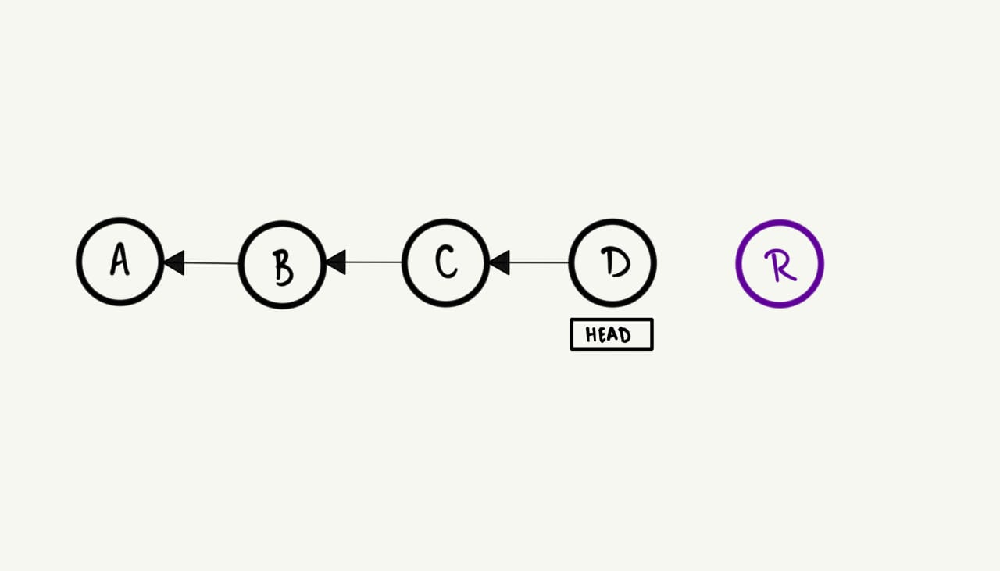
<br>

Note que, o commit "R" fica inacessível, mas o arquivo `E` continua presente no nosso diretório de trabalho.
Naturalmente, podemos corrigir o nome do commit e fazer um novo commit:

```terminal
git add E ; git commit -m E
```

### `git commit --amend`

Alternativamente, podemos usar o comando `git commit --amend`, que nos permite alterar o commit mais
recente, inclusive os arquivos que foram adicionados a ele.

```terminal
git commit --amend
```

Será aberto um editor de texto, onde você poderá alterar a mensagem do commit e após salvar e fechar o
editor, o commit será alterado.

## Workflow avançado

Todas essas funcionalidades que vimos até agora sobre o `git` são muito úteis, mas, até então, só
trabalhamos individualmente em pequenos projetos num ambiente controlado. Nesse sentido, é dada a hora
de finalmente começarmos a apreciar todo o potencial das ferramentas oferecidas pelo `git` para trabalhar
em ambientes de coloboração, onde, a primeira dessas ferramentas que vamos explorar são as *branches*.

### Git branching

Se você pensar no seu histórico de commits como uma árvore, você pode visualizar *branches* como
ramificações ou galhos dessa árvore, e a ideia por trás das *branches* é permitir que você e seus
companheiros de projeto, trabalhem em diferentes partes do projeto, sem interferir diretamente no trabalho
dos outros.

O uso dessa ferramenta pode variar a depender da necessidade e política de desenvolvimento de cada projeto,
entretanto, uma pratica comum é definir uma *branch* principal, geralmente chamada de `master` ou `main`,
e a cada nova funcionalidade ou correção de bug, criar uma nova *branch* a partir da principal.
Essas *branches* secundárias são o que chamamos de *topic branches* ou *feature branches*, e assim que elas
cumprem o seu propósito, são incorporadas na *branch* principal e deletadas.

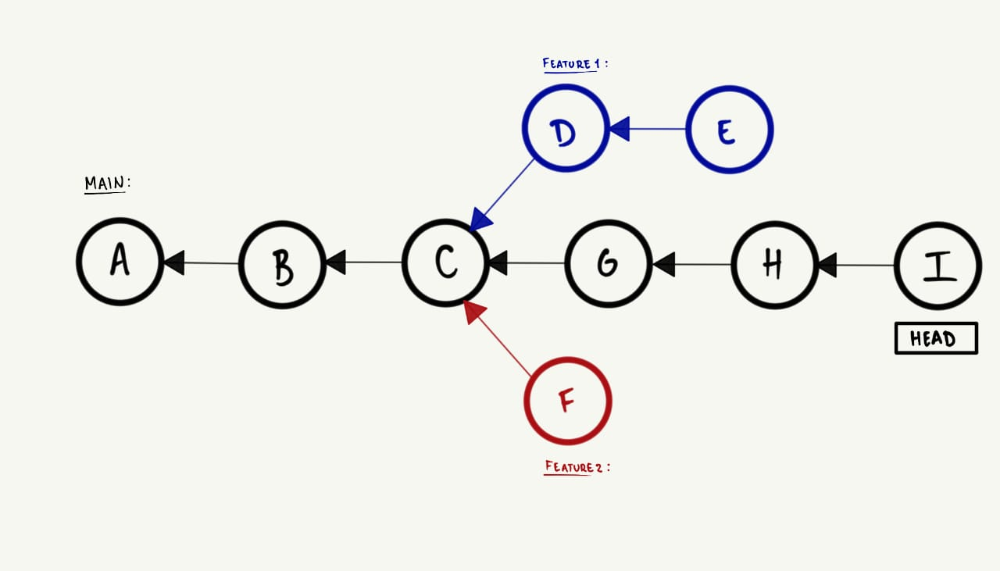
<br>

- A branch `main` é a linha de desenvolvimento principal, e as branches `feature1` e `feature2` são
ramificações que foram criadas para desenvolver novas funcionalidades.

Como você já deve ter visto, por padrão, o quando usamos o comando `git init`, o programa cria
automaticamente uma branch principal chamada de `master`. Uma vez criada, podemos tanto alterar o nome dela
para um nome mais significativo, por exemplo, `main`, quanto criar novas branches a partir dela e trabalhar
em novas funcionalidades para o projeto.

1. Podemos iniciar o repositório com a branch principal chamada de `main`:

  ```terminal
  git init --initial-branch=main
  ```

2. Logo após, podemos criar uma nova branch a partir dela com o `git branch <nome_da_branch> <branch_base>`:

  ```terminal
  git branch feature-legal main
  ```

- Alternativamente, podemos omitir o nome da *branch* base, e o `git` vai assumir que queremos criar a nova branch a partir da qual estamos atualmente.

3. Precisamos mudar para a nova branch para começar a trabalhar nela, então usamos o comando `git switch <branch>` (que serve apenas para trocar de branches) ou `git checkout` (mais sobre ele no futuro):

  ```terminal
  git switch feature-legal
  ```

Pronto! Já temos quase tudo que precisamos para trabalhar efetivamente com *branches*, podemos "commitar"
e fazer tudo que já sabemos fazer, mas agora, de forma isolada do restante do projeto, sem correr grandes
riscos. Contudo, ainda falta algumas nuances que precisamos tomar conhecimento, estas seriam como incorpar
as mudanças feitas numa branch em outra e como criar *branches* remotas.

#### Branches locais e remotas

Quando estamos trabalhando com repositórios remotos, é importante ficar claro que existem duas referências
a *branch* que estamos trabalhando atualmente, uma local e outra remota, e quando criamos uma nova branch
essa referência remota não é criada automaticamente, então, cabe a nós fazer isso manualmente.

Por exemplo, suponha que criamos uma nova branch local chamada `feature-legal` e fizemos alguns commits nela, e
então, quero compartilhar essa branch com meus colegas de trabalho ou apenas salvar o progresso na nuvem.
Para isso, podemos criar a referência remota com o seguinte comando:

```terminal
git push -u origin feature-legal
```

(Se o nome do repositório remoto for `origin`)

## Git merging

Nos últimos tópicos, vimos um punhado sobre *branches*, e como elas podem ser úteis para trabalhar em
equipe, mas, como que podemos concretizar um projeto usando *branches*, se não sabemos como juntar o
que foi feito em cada uma delas?

Dada essa preocupação, o `git` nos oferece o `git merge` que serve para integrar as alterações feitas em
uma *branch* a outra. Em qualquer "merge" ou mescla, a *branch* que está sendo mesclada é chamada de *
source branch*  e a *branch* que está recebendo as alterações é chamada de *target branch*, e seu uso
consiste em:

- Estando na *target branch*:

  ```terminal
  git merge <source_branch> 
  ```

Mas, nem sempre é tão simples assim, e existem diferentes formas em que o `git` pode realizar essa
mesclagem, as quais impactam diretamente no seu histórico de commits.

### Fast-forward merge

Uma das formas que o `merge` ocorre é *fast-foward*, e a ideia é que a *target branch* vai apenas avançar o seu histórico em relação a *source branch*, por exemplo, imagine o seguinte histórico de commits:

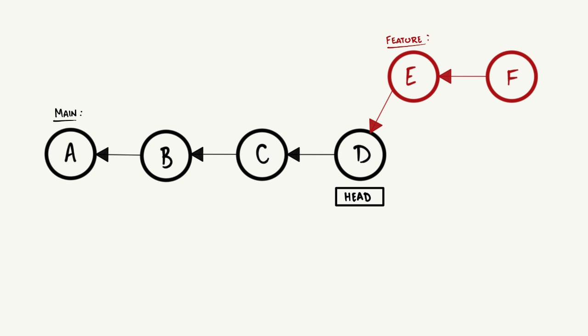
<br>

Suponha que a *branch* vermelha (`feature`) cumpriu seu propósito e agora você quer mesclar o que foi feito
nela a linha de desenvolvimento principal (`main`). Pensando de forma lúdica, o `git` realizaria a
mesclagem  apenas descendo essas bolinhas vermelhas e deixando equiparadas com a `main` e avançando o
`HEAD` para o commit mais recente da `feature`. Visualmente, isso ocorre da seguinte maneira:

1. E alinhado a linha de desenvolvimento principal:

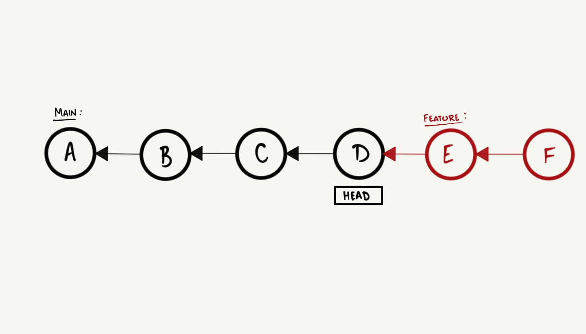
<br>

2. Os commits da *branch* `feature` são incorporados a `main`, e o `HEAD` avança:

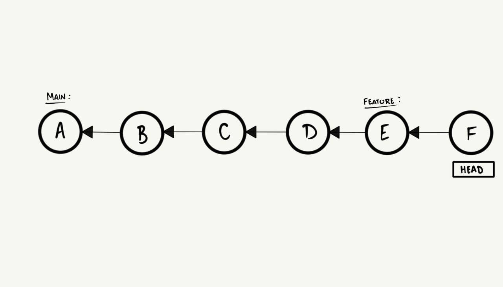
<br>

Mas e se a divergência não for assim tão simples e seu histórico estiver análogo a
[essa figura](#git-branching), seria possível fazer esse avanço?

### Three-way merge

A outra forma que o `git` realiza merges é o *three-way merge*, que acontece quando é impossível alcançar a
cabeça da *target branch*, seguindo os commits parentes a partir da cabeça da *source branch*, visualmente,
isso seria:

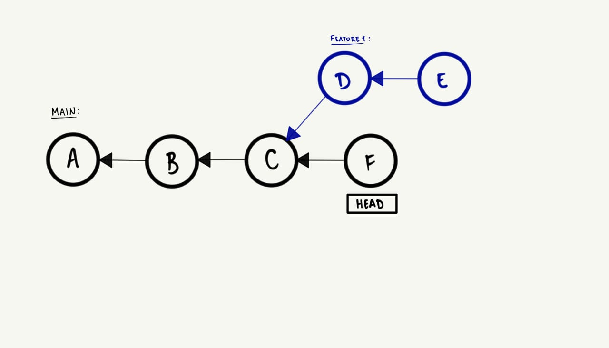
<br>

- Note que, de fato, é impossível alcançar o commit F, a partir do commit E, logo, isso significa que as branches
divergiram e que o `git` precisará realizar o *three-way merge*.

Para conseguir realizar a mesclagem, o `git` precisa criar um novo commit que tenha como parente os dois
últimos commits da *source* e *target* branch, de forma que o histórico das duas fiquem acessíveis a partir
da mesma branch.

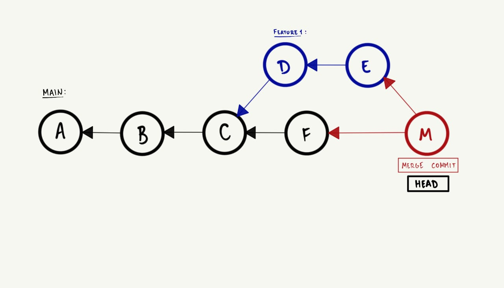
<br>

E esse processo só ocorre, se alterações feitas em uma branch não interferirem diretamente nas alterações
feitas na outra, caso contrário, o `git` não conseguirá realizar a mesclagem e você terá que resolver
cada conflito manualmente, para consolidar o *merge commit*.

### Lidando com conflitos

Para além do *three-way merge* e do `git`, um dos desafios mais clássicos que enfretamos ao trabalhar com
projetos e com outras pessoas é a resolução de conflitos. Seja por falta de comunicação entre a equipe,
planejamento, erro humano, ou qualquer outra razão, é muito comum que duas ou mais pessoas acabem
trabalhando na mesma parte do projeto ao mesmo tempo e isso resultar em conflitos.

Consequentemente, com o `git` não é diferente, e conflitos ocorrem no momento em que o `git` não consegue
mesclar duas branches automaticamente via *three-way merge*. Para resolver o conflito, você precisa
intervir diretamente na parte do arquivo que é conflitante entre as *branches* e decidir o que será mantido.

Portanto, vamos investigar quais são algumas das principais causas de conflitos e como resolvê-los.

#### Alterações no mesmo arquivo

Um conflito no *three-way merge* é dado quando duas ou mais pessoas trabalham na mesma parte
de um arquivo, visto que, ao mesclar as alterações, o `git` é incapaz de decidir qual versão manter. Dessa
forma, O `git` vai te dizer em qual arquivo houve conflito, e vai decorar o arquivo com marcações especiais
para lhe mostrar as diferentes versões de determinadas linhas do arquivo. Essas marcações são:

```terminal
<<<<<<< HEAD
{ Conteúdo da target branch }
=======
{ Conteúdo da source branch* }
>>>>>>> { source branch }
```

Para resolver esse tipo de conflito, voce vai precisar:

- Decidir o que manter, editar o arquivo e remover a decoração de conflito.
- Adicionar o arquivo ao *stage* e consolidar o *merge commit*.

#### Estado do repositório local e repositório remoto

Em qualquer projeto que envolva mais de uma pessoa, naturalmente, ocorrerão mudanças recorrentes no
repositório, e sempre alguem vai terminar antes ou depois de outra pessoa. Nesse sentido, tente visualizar
comigo o seguinte cenário:

- Você e seu colega estão trabalhando em duas funcionalidades diferentes no mesmo projeto, e o histórico
de commits se parece com isso:

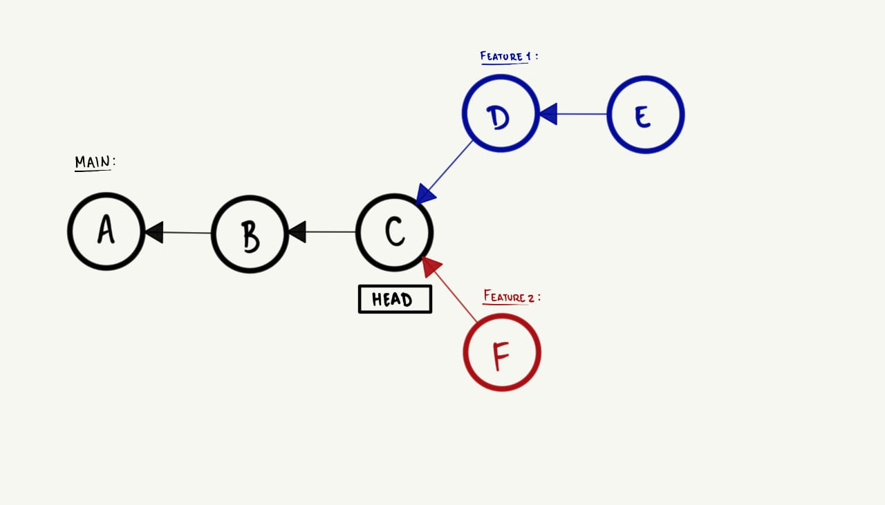
<br>

- Seu colega terminou antes de você e publicou a branch dele remotamente, e já incorporou as alterações
dele na `main`.

  | Sua versão local| Versão remota |
  | -------------- | --------------- |
  |  |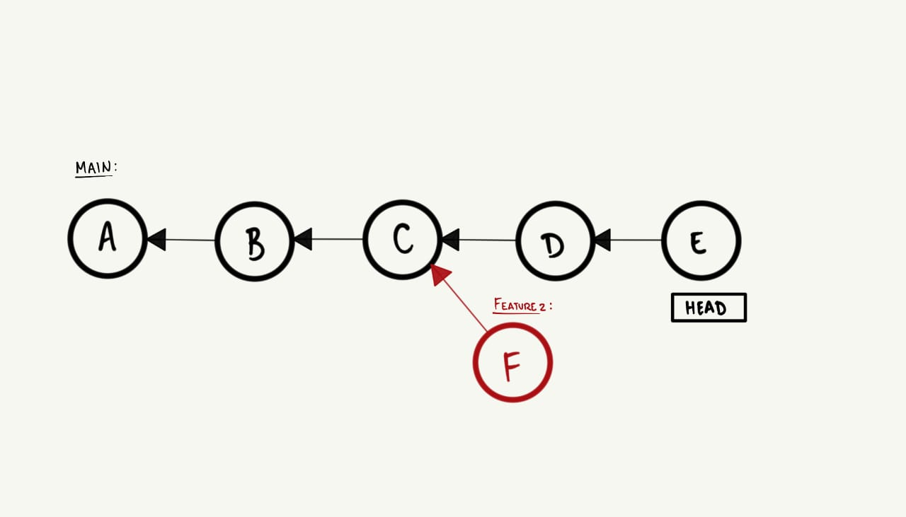 |

- Você terminou a sua parte e você incorporou as alterações dele na sua branch, e agora você quer publicar
o que foi feito remotamente.

  | Sua versão local| Versão remota |
  | -------------- | --------------- |
  | 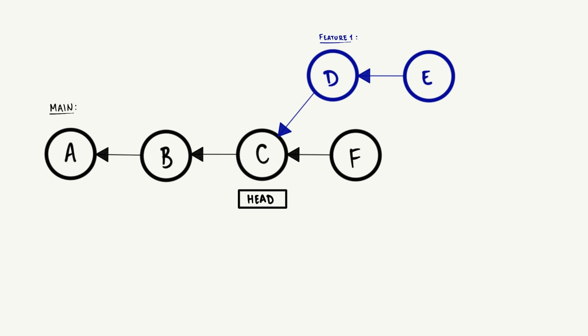 |

- Entretanto, o `git` não vai permitir que você publique as alterações remotamente, visto que, o histórico
de commits da sua branch `main` divergiu completamente da versão remota.

Dada, a problemática, o que fazer?

O `git` vai te dar a oportunidade de mesclar a sua branch local com a remota via *three-way merge*, para
que você consiga publicar as alterações com sucesso. Mas, note que, será criado um commit desnecessário
por descuido, além da alta chance de haver conflitos por possíveis alterações no mesmo arquivo.

Num cenário ideal, sempre antes e depois de trabalhar atualize o seu repositório local com os comandos que
já aprendeu, para evitar esse tipo de problema.

#### Divergências significativas

Mais comum do que se imagina, principalmente em grandes equipes ou novatos no uso do `git` é a criação de
divergências significativas em uma ou mais branches. Por exemplo, se você está trabalhando em uma branch
`feature` equanto seu colega está na `main` e ambos fizeram mudanças significativas que afetaram o mesmo
arquivo, certamente, não vai ser possível incorporar suas mudanças na branch principal.

E a causa desse tipo de conflito, é principalmente a falta de comunicação e planejamento entre as partes.

#### Prevenindo conflitos

A maioria dos conflitos no `git` não fogem muito do que foi apresentado até agora, então, para previnir
esses tipos de conflitos, alguma práticas são recomendadas:

- **Comunique-se constatemente e abertamente com a equipe** sobre quais partes do projeto cada um está trabalhando.

- Faça **commits frequentes** e pequenos assim como a
[filosofia do Unix](/primeiroDia.md#filosofia-unix-programas-simples-e-combináveis) sugere para o
desenvolver de software. Isso mantém o repositório atualizado, diminui a chance de conflitos e facilita
revisitar o commit no futuro.

- **Mantenha suas branches de *feature* curtas e mescle-as na `main` frequentemente**, pois branches de
longa-duração tendem a se desviar significantemente de outras e criar conflitos.

## Projeto pt.1

### Visão geral

Nessa altura, você provavelmente já deve estar familiarizado com o `git`, como usar, investigar comandos
no terminal e até mesmo criar seus próprios comandos. Portanto, para se familiarizar mais com o workflow
do `git`, lhe convido a desenvolver um gerador de senhas seguras com vase em critérios definidos pelo
usuário. Este projeto deverá ser realizado em duplas, e deve ser feito usando o `git` como versionador
e GitHub como serviço de hospedagem.

### Sumário

- [Definição do projeto](#definição-do-projeto)
- [Requisitos do projeto](#requisitos-do-projeto)
- [Funcionalidades](#funcionalidades)
  - [Geração de senhas](#geração-de-senhas)
  - [Armazenamento seguro](#armazenamento-seguro)
- [Interface e como usar o script](#interface-e-como-usar-o-script)
  - [Exemplos de uso](#exemplos-de-uso)
- [Estrutura do código](#estrutura-do-código)
- [Colaboração](#colaboração)
- [Submissão](#submissão)

### Definição do projeto

O nosso gerador de senhas deve permitir ao usuário especificar o comprimento da senha e os tipos de
caracteres a serem incluídos (letras maiúsculas, minúsculas, números e símbolos). Além disso, deve fornecer
uma simples interface de `help` no terminal, para que o usuário possa entender como o programa pode ser
usado.

### Requisitos do projeto

- O programa deve ser escrito em Shell script.
- Os autores devem usar o `git` e o GitHub para versionar o projeto.
- Os autores devem incluir um arquivo `README.md` com uma descrição do projeto instruções de uso e exemplos.

### Funcionalidades

#### Geração de senhas

O script deve permitir a geração de senhas aleatórias com base nos seguintes critérios:

- Comprimento da senha.
- Inclusão de letras maiúsculas.
- Inclusão de letras minúsculas.
- Inclusão de números.
- Inclusão de símbolos.

Para gerar a senha, faça uso do `/dev/urandom`, é um arquivo que se atualiza com bytes aleatórios, uma
vez filtrados esses bytes podem se tornar uma senha segura, para isso pesquise sobre o comando `tr` e o
`head` para traçar um plano de como fazer isso.

#### Armazenamento seguro

Opcionalmente, o script deve permitir armazenar senhas de forma criptografada em um arquivo. Para isso,
investigue o uso da ferramenta `openssl`.

### Interface e como usar o script

```terminal
$ ./password-generator.sh -h
Bem vindo o password-generator! Versão 1.0, (c) 2024, Fulano de Tal, DIMAp, UFRN
Uso: ./password-generator.sh [OPÇÕES]
Opções:
  -l [COMPRIMENTO] : comprimento da senha
  -u               : incluir letras maiúsculas
  -d               : incluir números
  -s               : incluir símbolos
  -h               : exibir essa mensagem de ajuda

O comportamento padrão do script é gerar uma senha de 8 caracteres minúsculos.
```

#### Exemplos de uso

- Gerar uma senha de 8 caracteres com letras minúsculas:

    ```terminal
    $ ./password-generator.sh
    Senha gerada: drmeaypb
    ```

- Gerar uma senha de 12 caracteres com letras maiúsculas:

    ```terminal
    $ ./password-generator.sh -l 12 -u
    Senha gerada: jQaAukomyhkS
    ```

- Gerar uma senha com tamanho 42 com letras maiúsculas, números e símbolos:

    ```terminal
    $ ./password-generator.sh -l 42 -u -d -s
    Senha gerada: d5,|J-sB,$+=KiV/dSs6CpV35OmI]c9|cZk.Qzpq8M
    ```

### Estrutura do código

```bash
#!/bin/bash
# Função para exibir a ajuda
show_help() {
  # Implementação vai aqui
}

# Definir variáveis padrão
LENGTH=8
USE_UPPERCASE=false
USE_DIGITS=false
USE_SYMBOLS=false

# Parsear argumentos
# { Implementação vai aqui }

# Definir conjuntos de caracteres
LOWERCASE="abcdefghijklmnopqrstuvwxyz"
UPPERCASE="ABCDEFGHIJKLMNOPQRSTUVWXYZ"
DIGITS="0123456789"
SYMBOLS="!@#$%^&*()-_=+[]{}|;:,.<>?/~"

# Construir a lista de caracteres permitidos

# Gerar a senha: 
# o /dev/urandom gera bytes aleatórios, para conseguir
# uma senha precisamos limpar esses bytes de alguma forma
PASSWORD=$(cat /dev/urandom) 

# Exibir a senha gerada
echo "Senha gerada: $PASSWORD"

# Opcional: salvar a senha em um arquivo criptografado
# Implemente como essa senha será criptografada com o openssl
echo $PASSWORD >> password.txt.enc
```

### Colaboração

Esse projeto pode ser divido em duas partes, a primeira parte seria a interface e o processamento de
argumentos da linha de comando e a segunda parte seria a investigação de como usar o `/dev/urandom`.

### Submissão

Um email para [inserir email aqui], com o link do repositório e nome completo dos autores é suficiente.
Apenas  um membro da dupla deve realizar a submissão
