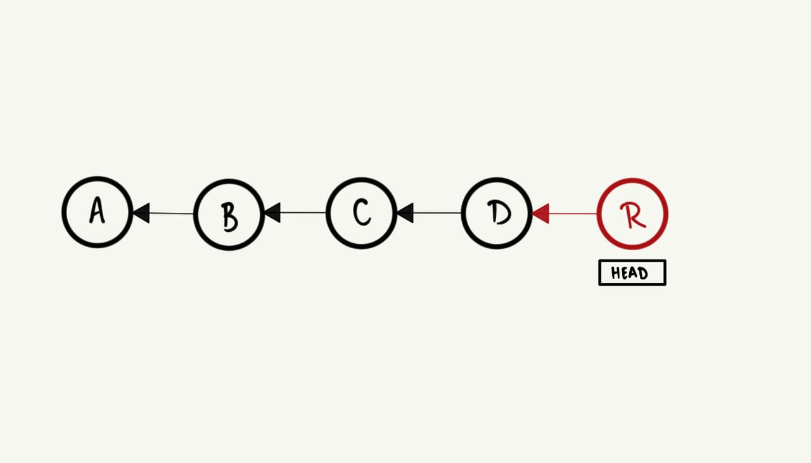

[TOC]

# Git avançado

## Desfazendo alterações

No [último tópico](/terceiroDia.md), tivemos o nosso primeiro contato com o `git`, e aprendemos a criar
repositórios para nos ajudar a rastrear as alterações feitas no nosso projeto localmente e remotamente.
Entretanto, durante o desenvolvimento de um projeto, não é incomum cometer erros ou fazer alterações
indesejáveis. Por exemplo, alterar um arquivo sem querer, ou adicionar um arquivo que não deveria ser
adicionado, ou até mesmo fazer um commit com uma mensagem errada.

Além disso, quando ainda estamos desenvolvendo certa maturidade em relação ao uso do `git` é muito comum
tomar medidas extremas, para solucionar diferentes tipos de problemas, sem de fato usar os meios que a
ferramenta nos oferece. Por exemplo, quem nunca deletou e baixou o repositório novamente para se livrar de
um simples `commit` errado?

Por isso, gostaria de apresentar algumas formas seguras e mais "elegantes" de lidar com alguns tipos de
problemas que podem surgir durante o desenvolvimento de um projeto.

### Desfazendo *commits* sem ter publicado

Imagine, por exemplo, que você tem um repositório com seguinte histórico de commits:


<br>

Você estava desenvolvendo a funcionalidade `E`, e agora é momento de finalmente fazer o *commit* e salvar
essa mudança:

```terminal
$ git status
On branch main
Untracked files:
  (use "git add <file>..." to include in what will be committed)
 E

nothing added to commit but untracked files present (use "git add" to track)

$ git add E ; git commit -m R
[main 0156e00] R
 1 file changed, 0 insertions(+), 0 deletions(-)
 create mode 100644 E
```

Porém, imediatamente após fazer o *commit*, você percebe que cometeu um erro e que o nome do commit na
verdade deveria ser "E" ao invés de "R". E agora, o que fazer?

Revisitando o nosso histórico de commits (podemos fazer isso com o comando `git log --oneline`), urge
a necessidade de voltar para o commit anterior e corrigir o nome do commit.


<br>

Para isso, existem algumas possibilidades, dentre as quais:

#### `git reset`

A primeira ideia é usar o comando `git reset`, visto que, ele tem a capacidade de mover o `HEAD`, para um
commit anterior, onde por padrão, arquivos alterados são preservados mas não ficam na *stagin area*.

Então, para simplesmente voltar para o commit anterior, podemos fazer:

```terminal
git reset HEAD~1
```

onde, o `~1` indica a quantidade de commits que queremos voltar, no caso, 1 commit. Agora, nosso histórico
de commits fica assim:


<br>

Note que, o commit "R" fica inacessível, mas o arquivo `E` continua presente no nosso diretório de trabalho.
Naturalmente, podemos corrigir o nome do commit e fazer um novo commit:

```terminal
git add E ; git commit -m E
```

### `git commit --amend`

Alternativamente, podemos usar o comando `git commit --amend`, que nos permite alterar o commit mais
recente, inclusive os arquivos que foram adicionados a ele.

```terminal
git commit --amend
```

Será aberto um editor de texto, onde você poderá alterar a mensagem do commit e após salvar e fechar o
editor, o commit será alterado.

## Workflow avançado

Todas essas funcionalidades que vimos até agora sobre o `git` são muito úteis, mas, até então, só
trabalhamos individualmente em pequenos projetos num ambiente controlado. Nesse sentido, é dada a hora
de finalmente começarmos a apreciar todo o potencial das ferramentas oferecidas pelo `git` para trabalhar
em ambientes de coloboração, onde, a primeira dessas ferramentas que vamos explorar são as *branches*.

### Git branching

Se você pensar no seu histórico de commits como uma árvore, você pode visualizar *branches* como
ramificações ou galhos dessa árvore, e a ideia por trás das *branches* é permitir que você e seus
companheiros de projeto, trabalhem em diferentes partes do projeto, sem interferir diretamente no trabalho
dos outros.

O uso dessa ferramenta pode variar a depender da necessidade e política de desenvolvimento de cada projeto,
entretanto, uma pratica comum é definir uma *branch* principal, geralmente chamada de `master` ou `main`,
e a cada nova funcionalidade ou correção de bug, criar uma nova *branch* a partir da principal.
Essas *branches* secundárias são o que chamamos de *topic branches* ou *feature branches*, e assim que elas
cumprem o seu propósito, são incorporadas na *branch* principal e deletadas.


<br>

* A branch `main` é a linha de desenvolvimento principal, e as branches `feature1` e `feature2` são
ramificações que foram criadas para desenvolver novas funcionalidades.

Como você já deve ter visto, por padrão, o quando usamos o comando `git init`, o programa cria
automaticamente uma branch principal chamada de `master`. Uma vez criada, podemos tanto alterar o nome dela
para um nome mais significativo, por exemplo, `main`, quanto criar novas branches a partir dela e trabalhar
em novas funcionalidades para o projeto.

1. Podemos iniciar o repositório com a branch principal chamada de `main`:

  ```terminal
  git init --initial-branch=main
  ```

2. Logo após, podemos criar uma nova branch a partir dela com o `git branch <nome_da_branch> <branch_base>`:

  ```terminal
  git branch feature-legal main
  ```

* Alternativamente, podemos omitir o nome da *branch* base, e o `git` vai assumir que queremos criar a nova branch a partir da qual estamos atualmente.

3. Precisamos mudar para a nova branch para começar a trabalhar nela, então usamos o comando `git switch <branch>` (que serve apenas para trocar de branches) ou `git checkout` (mais sobre ele no futuro):

  ```terminal
  git switch feature-legal
  ```

Pronto! Já temos quase tudo que precisamos para trabalhar efetivamente com *branches*, podemos "commitar"
e fazer tudo que já sabemos fazer, mas agora, de forma isolada do restante do projeto, sem correr grandes
riscos. Contudo, ainda falta algumas nuances que precisamos tomar conhecimento, estas seriam como incorpar
as mudanças feitas numa branch em outra e como criar *branches* remotas.

#### Branches locais e remotas

Quando estamos trabalhando com repositórios remotos, é importante ficar claro que existem duas referências
a *branch* que estamos trabalhando atualmente, uma local e outra remota, e quando criamos uma nova branch
essa referência remota não é criada automaticamente, então, cabe a nós fazer isso manualmente.

Por exemplo, suponha que criamos uma nova branch chamada `feature-legal` e fizemos alguns commits nela, e
então quero compartilhar essa branch com meus colegas de trabalho ou apenas salvar o progresso na nuvem.
Para isso, podemos criar a referência remota da seguinte forma:

```terminal
git push -u origin feature-legal
```

(Se o nome do repositório remoto for `origin`)

<!--- TODO: Parei aqui
--->

## Git merging

### Ramificação e mesclagem simples

Primeiramente, digamos que você esteja trabalhando em seu projeto e já tenha alguns commits na branch principal (geralmente chamada de `master`).

Você decidiu que vai trabalhar na criação de uma nova funcionalidade de chat para o site.

Para criar uma nova branch e mudar para ela ao mesmo tempo, você pode executar o comando `git checkout` com a opção `-b`:

```bash
$ git checkout -b chat-feature
Switched to a new branch "chat-feature"
```

Isso é equivalente a:

```bash
git branch chat-feature
git checkout chat-feature
```

Ao fazer isso, você cria e muda para a nova branch `chat-feature` onde começará a trabalhar na funcionalidade de chat.

```bash
echo "código do chat versão 1" > chat.txt
git add chat.txt
git commit -m 'Criei a versão 1 do chat'
```

Porém, um problema importante surgiu e precisamos corrigi-lo imediatamente. Vamos voltar para a branch `master` e criar uma nova branch a partir dela para fazer essa correção.

Antes de mudar de branch, é importante garantir que seu trabalho atual esteja salvo (commitado), pois o Git não permite mudar de branch se houver mudanças não salvas que possam conflitar.

Agora podemos mudar para a branch `master`:

```bash
$ git checkout master
Switched to branch 'master'
```

Neste ponto, o projeto estará exatamente como estava antes de você começar a trabalhar na funcionalidade de chat. Agora podemos nos concentrar na correção urgente.

Vamos criar uma branch chamada `correcao-chat` para trabalhar na correção:

```bash
$ git checkout -b correcao-chat
Switched to a new branch 'correcao-chat'
```

Depois de corrigir o problema, vamos fazer o commit:

```bash
$ echo "Corrigir bug crítico" > correcaobug.txt
$ git add correcaobug.txt
$ git commit -m 'Corrigir bug crítico'
[correcao-chat 1fb7853] Corrigir bug crítico
1 file changed, 1 insertion(+)
```

Agora, você pode testar e garantir que a correção está correta. Em seguida, vamos mesclar a branch `correcao-chat` de volta para a branch `master`:

```bash
$ git checkout master
$ git merge correcao-chat
Updating f42c576..3a0874c
Fast-forward
correcaobug.txt | 1 +
1 file changed, 1 insertion(+)
```

A expressão “fast-forward” significa que a mesclagem foi simples e direta, sem conflitos. O Git apenas moveu a linha do tempo para incluir as mudanças da branch `correcao-chat`.

Após a mesclagem, podemos deletar a branch `correcao-chat` pois não é mais necessária:

```bash
$ git branch -d correcao-chat
Deleted branch correcao-chat (3a0874c).
```

Agora podemos voltar para a branch `chat-feature` e continuar trabalhando na funcionalidade de chat:

```bash
$ git checkout chat-feature
Switched to branch "chat-feature"
$ echo "Chat feature finalizado" >> chat.txt
$ git add chat.txt
$ git commit -m 'Terminei o chat feature'
[chat-feature ad82d7a] Finish chat feature
1 file changed, 1 insertion(+)
```

Se precisar das mudanças da correção (`correcao-chat`) na sua branch `chat-feature`, você pode mesclar a branch `master` na `chat-feature` com:

```bash
git merge master
```

### Outra forma de mesclagem

Quando terminar o trabalho na funcionalidade de chat e estiver pronto para mesclar de volta para a branch `master`, você pode fazer o merge da mesma forma que fez com `correcao-chat`:

```bash
$ git checkout master
Switched to branch 'master'
$ git merge chat-feature
Merge made by the 'recursive' strategy.
chat.txt |    1 +
1 file changed, 1 insertion(+)
```

Este tipo de mesclagem é diferente porque as duas branches (`master` e `chat-feature`) têm históricos diferentes. O Git faz uma mesclagem de três vias, usando o último commit comum entre as duas branches e os commits mais recentes de cada uma para criar um novo commit que une as mudanças.

Depois da mesclagem, você pode excluir a branch `chat-feature`:

```bash
git branch -d chat-feature
```

### Conflitos básicos de mesclagem

Às vezes, o processo de mesclagem não ocorre sem problemas. Se você alterou a mesma parte de um arquivo em duas branches diferentes, o Git não conseguirá mesclar automaticamente. Isso gera um conflito de mesclagem:

```bash
$ git merge chat-feature
Auto-merging chat.txt
CONFLICT (content): Merge conflict in chat.txt
Automatic merge failed; fix conflicts and then commit the result.
```

Para resolver o conflito, abra o arquivo e veja as partes conflitantes:

```plaintext
Chat feature finalizado
```

Edite o arquivo para resolver o conflito e salve as mudanças. Depois, adicione o arquivo ao stage:

```bash
git add chat.txt
```

Quando todos os conflitos forem resolvidos, finalize a mesclagem com um commit:

```bash
git commit
```

Se você acha que seria útil para outras pessoas olhar para este merge no futuro, você pode modificar esta mensagem de confirmação com detalhes sobre como você resolveu o conflito e explicar por que você fez as mudanças que você fez se elas não forem óbvias.

### Exercicio 3
