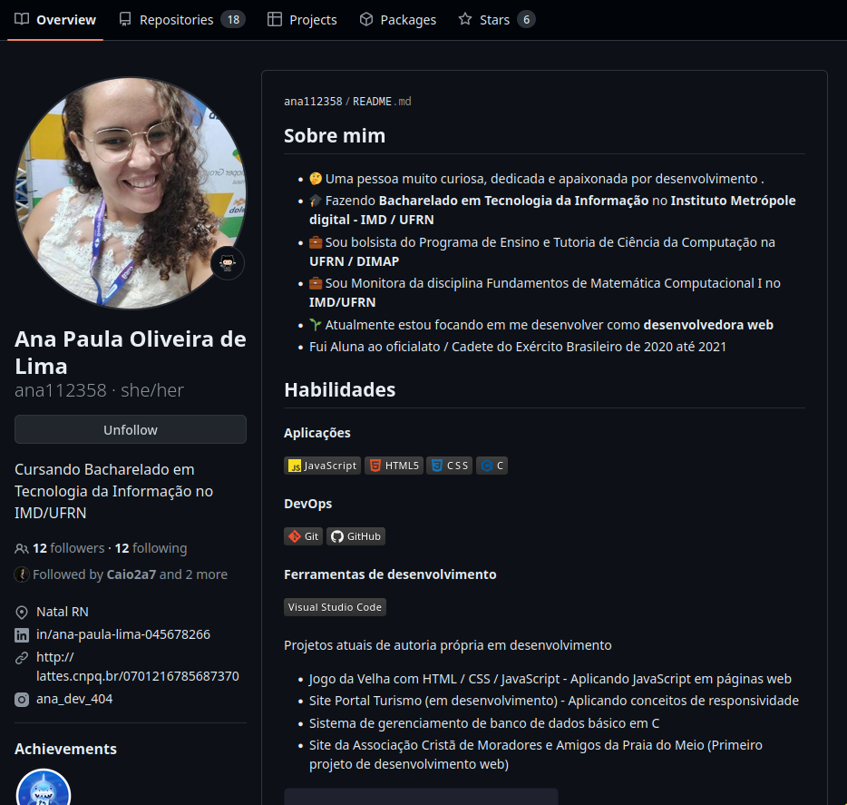
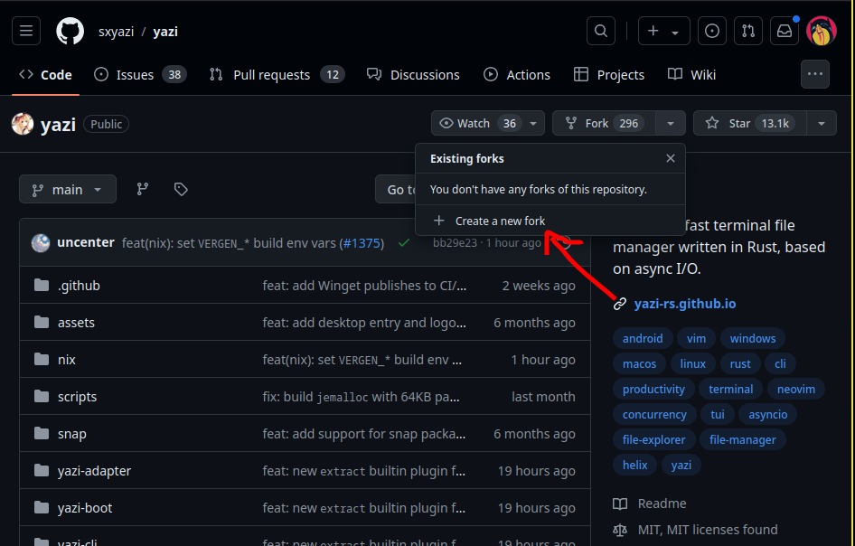

## GitHub e boas práticas de Git

Na aula anterior, começamos a trabalhar conceitos mais avançados de Git e Github, os quais permitem
trabalhar de forma colaborativa em projetos de software. Nesta aula, vamos explorar <spam class="destaque">boas práticas</spam> envolvendo
esses conceitos além de descobrir algumas novas funcionalidades do Git.

### Pull requests

Primeiro, vamos relembrar o que sabemos sobre branches e o workflow tradicional
do Git, no qual temos uma branch principal e criamos branches paralelas para desenvolver novas funcionalidades
que são posteriormente integradas à branch principal. Num workflow tradicional, o processo de integração
ocorre através de merges, e esses merges são <spam class="destaque">executados primeiro localmente</spam> e depois publicados no
<spam class="destaque">repositório remoto</spam>. Entretanto, essa não é a única forma de integrar novas funcionalidades ao projeto,
ferramentas de hospedagem remota como o <spam class="destaque">GitHub</spam> , por exemplo, permitem que os desenvolvedores criem o que
chamamos de <spam class="destaque">pull requests</spam> .

O pull request (merge requests), ou PR, nada mais é que uma <spam class="destaque">solicitação para que as alterações que foram feitas<spam class="destaque"> em uma
<spam class="destaque">branch</spam> sejam <spam class="destaque">incorporadas</spam> a outra branch do projeto, e a grande vantagem do PR é que ele favorece a
<spam class="destaque">comunicação</spam> e a<spam class="destaque">transparência</spam> entre os desenvolvedores. Pois, quando um pull request é criado, dentro da
plataforma de hospedagem, os <spam class="destaque">colaboradores são notificados</spam> e podem <spam class="destaque">visualizar</spam>, <spam class="destaque">comentar</spam> e <spam class="destaque">revisar</spam> as alterações feitas na branch.

O processo de pull request é muito simples e pode ser quebrado em alguns passos:

1. Crie uma <spam class="destaque">branch local</spam> e faça as <spam class="destaque">alterações</spam> desejadas.
2. <spam class="destaque">Publique a branch</spam> local no repositório remoto.
3. Acesse o repositório remoto e <spam class="destaque">crie um pull request</spam>.
4. Peça para um ou mais colaboradores <spam class="destaque">revisarem</spam> seu código e faça alguma alteração se necessário.
5. Após aprovado e revisado, o pull request pode ser <spam class="destaque">integrado</spam> ao projeto.
6. <spam class="destaque"> Delete a branch</spam> remota e local.

Algumas boas práticas envolvendo a criação de pull requests são:

1. <spam class="destaque">Revisar bem</spam> seu código e pull request antes de submetê-lo.
2. Escrever um <spam class="destaque">bom título</spam> e <spam class="destaque">descrição consisa</spam> e com propósito claro.
3. Prover <spam class="destaque">contexto</spam> e <spam class="destaque">informações</spam> adicionais que possam ajudar o <spam class="destaque">revisor</spam>.

## *Rebase*

Até então, vimos que o Git possui um comando chamado <spam class="destaque">merge</spam> que é usado para <spam class="destaque">integrar alterações</spam> de uma branch, e que também podemos fazer isso remotamente usando um <spam class="destaque">pull request</spam>. Contudo, existe uma outra forma
de fazer isso que, em muitos casos, pode ser mais interessante: o <spam class="destaque">rebase</spam>.

Assim como o <spam class="destaque">merge</spam> o <spam class="destaque">rebase</spam> também explora o conceito de <spam class="destaque">source branch</spam> e <spam class="destaque">target branch</spam>, mas, ao invés
de tentar conectar o histórico das duas branches, esse comando <spam class="destaque">reaplica as alterações</spam> da <spam class="destaque">source branch</spam>
no <spam class="destaque">topo da target</spam>. Agora, vamos visualizar isso:

- Primeiro, imagine o seguinte histórico de commits:

  
  <br>

- Agora, invés de criar um commit extra, quando usamos o comando <spam class="destaque">git rebase feature</spam> todos os commits da <spam class="destaque">branch feature</spam>
  são reaplicados no <spam class="destaque">topo da branch main</spam>:

  
  <br>

Assim como o *three-way merge*, o `rebase` só funciona dessa forma se <spam class="destaque">não houverem conflitos</spam> entre as branches e o processo
de resolução de conflitos for análogo ao que vimos anteriormente. A grande <spam class="destaque">vantagem do `rebase` </spam> é que ele mantém o <spam class="destaque">histórico
de commits mais limpo e linear</spam>, o que pode ser a preferência de muitas equipes. Entretanto, apesar de ser intuitivamente
mais simples, o `rebase` é uma operação <spam class="destaque">relativamente mais complexa</spam> que o `merge` e, se não for usada com cuidado, pode lhe
causar muita dor de cabeça.

### Cuidados com o *rebase*

Como foi dito anteriormente, o `rebase` é uma operação mais complexa que o `merge` e deve ser usada com cuidado, pois essa operação
<spam class="destaque">reescreve o histórico de commits</spam>, e isso pode causar problemas chatos de resolver.
Por isso, existe uma regrinha de ouro que podemos seguir para evitar esse tipo de problema:

*Não utilize o comando rebase em uma branch que outras pessoas estão usando*: Por exemplo, se você publicou uma branch no repositório
remoto, agora ela é de domínio público e outras pessoas podem estar trabalhando nela, se você fizer um rebase nessa branch
as pessoas vão ter que lidar com um histórico de commits completamente diferente e haverão conflitos.

Para sempre <spam class="destaque">evitar problemas </spam>envolvendo `rebase`, use-o se somente se:

- Você tem uma <spam class="destaque">branch local que não foi publicada</spam> no repositório remoto.
- Você está trabalhando em uma branch local ou remota que você tem <spam class="destaque">certeza</spam>que <spam class="destaque">ninguém mais está usando</spam>.

## Stash

Saindo um pouco do assunto de branches e pull requests, vamos falar agora sobre um comando que pode ser muito útil em
algumas situações do dia-a-dia. O comando <spam class="destaque">git stash</spam> é usado para <spam class="destaque">salvar, de forma temporária</spam> e rápida as <spam class="destaque">alterações</spam> que
você estava fazendo na sua <spam class="destaque">branch local</spam>, permitindo que você possa mudar de branch ou fazer outras operações sem ter que
"commitar" ou descartar as alterações. Seu uso é extremamente simples e pode ser quebrado em alguns passos:

1. Salve as alterações que você estava fazendo com <spam class="destaque">git stash</spam>, alternativamente, use a flag <spam class="destaque">-u</spam> ou <spam class="destaque">-m</spam> para salvar suas
suas alterações <spam class="destaque">não rastreadas</spam> ou salvar as alterações <spam class="destaque">com mensagens</spam>, respectivamente.

2. <spam class="destaque">Troque de branch</spam> ou faça as operações que você deseja.

3. Recupere as alterações salvas com <spam class="destaque">git stash pop [opcional-nome_do_stash]</spam>, alternativamente, use <spam class="destaque">git stash apply [opcional-nome_do_stash]</spam> para manter as <spam class="destaque">alterações salvas no stash</spam>.

Alguns sub-comandos do `git stash` que também podem ser úteis são:

- git stash list: <spam class="destaque">Lista</spam> todos os stashes salvos.
- git stash drop: <spam class="destaque">Remove</spam> um stash específico.
- git stash clear: Remove <spam class="destaque">todos</spam> os stashes salvos.
- git stash show [nome_do_stash]: Mostra as <spam class="destaque">alterações</spam> salvas em um stash específico.

## Pout-Pourri

Para os propósitos do curso, finalmente exploramos tudo que nós do PET consideramos <spam class="destaque">mais essencial</spam> e suficiente envolvendo <spam class="destaque">Linux, Git e Github</spam>, principalmente no âmbito de cursos de Computação na graduação. Claro que, naturalmente, existem muitas outros conceitos, comandos, ferramentas, histórias e boas práticas que <spam class="destaque">não foram abordadas</spam>, por isso, nestes últimos tópicos, lhe convidamos a explorar alguns assuntos extras que podem ser interessantes para você.

### Changelog e README

Geralmente, quando começamos no Github e passamos a trabalhar em projetos, seguir outros desenvolvedores e ver o que eles
estão fazendo, é muito comum nos depararmos com arquivos chamados `CHANGELOG.md` e `README.md` (inclusive, fizemos um deles
no último projeto). Por exemplo, no repositório do `yazi` (**github.com/sxyazi/yazi**):


<br>

O arquivo <spam class="destaque">README.md </spam> é uma <spam class="destaque">porta de entrada</spam> para o seu projeto, e também pode ser visto como a <spam class="destaque">documentação principal</spam> do
projeto. Nele, você pode colocar <spam class="destaque">informações sobre o projeto</spam>: como instalar, como usar, quem são os colaboradores, etc.
Além disso, é o README que vai ser o primeiro arquivo visto por aqueles que acessarem o seu repositório, então, como diz o ditado, a primeira impressão é a que fica.

Além do README, o <spam class="destaque">CHANGELOG</spam> é outro arquivo que pode ser muito importante para um projeto de software, pois é usado para <spam class="destaque">documentar mudanças</spam> significativas foram realizadas entre cada versão do software.
Para criar um bom <spam class="destaque">CHANGELOG.md</spam> você pode seguir um padrão de formatação
([keepachangelog](https://keepachangelog.com/en/1.1.0/) em inglês) que segue alguns passos:

- Changelogs são para <spam class="destaque">humanos</spam>, não máquinas.
- Cada <spam class="destaque">versão</spam> deve ser <spam class="destaque">datada</spam>.
- Os mesmos <spam class="destaque">tipos de mudanças</spam> devem ser agrupados.
- As <spam class="destaque">mudanças</spam> devem ser descritas de forma <spam class="destaque">clara</spam> e <spam class="destaque">concisa</spam>.
- As mudanças devem ser listadas em <spam class="destaque">ordem decrescente</spam> de importância.
- A <spam class="destaque">última versão</spam> deve ser a <spam class="destaque">primeira entrada</spam>.
- Mencionar se segue o [Semantic Versioning](https://semver.org/).

Para mais informações sobre o `CHANGELOG.md` convido-lhe a acessar o site
[keepachangelog](https://keepachangelog.com/en/1.1.0/).

### Perfil no GitHub

Lembrando que o Github também é uma <spam class="destaque">rede social</spam>, em especial, para desenvolvedores, empresas, equipes, recrutadores e pessoas com interresse em tecnologia do mundo todo, e, por isso, pode ser muito importante
que você tenha um <spam class="destaque">perfil organizado</spam>, <spam class="destaque">bem apresentável</spam> e <spam class="destaque">bastante ativo</spam>. Algumas dicas relacionadas ao perfil
do Gihub são:

- Matenha <spam class="destaque">foto de perfil</spam> e informações básicas <spam class="destaque">atualizadas</spam>.
- Adicione um <spam class="destaque">README.md</spam> ao seu perfil: Assim como o README de um repositório, o README do perfil pode ser usado para se <spam class="destaque">apresentar</spam>, mostrar suas <spam class="destaque">habilidades</spam>, <spam class="destaque">projetos</spam>, etc.
- Gerencie seus repositórios: Coloque seus <spam class="destaque">repositórios mais relevantes no topo</spam>, organize-os em <spam class="destaque">categorias</spam>, use tópicos, etc.
- E, principalmente, seja ativo: <spam class="destaque">Contribua em outros projetos</spam>, crie projetos, <spam class="destaque">siga pessoas</spam> e <spam class="destaque">empresas</spam>, etc.


<br>

### Issues

Lembra do que eu falei sobre ser ativo no Github? Uma das formas mais interessantes de <spam class="destaque">colaborar</spam> para a
comunidade é <spam class="destaque">através das issues</spam>. As issues, são basicamente um <spam class="destaque">espaço para discussões</spam>, <spam class="destaque">sugestões</spam>, <spam class="destaque">reporte
de bugs</spam>, <spam class="destaque">problemas</spam> etc. Elas funcionam como uma forma de comunicar diretamente os colaboradores de
um projeto sobre <spam class="destaque">algo que você encontrou</spam>.


<br>

A depender do projeto, pode ser necessário que as issues sigam algum <spam class="destaque">template específico</spam>, mas um bom
guia geral para criar uma issue é:

```markdown
**Descrição do bug**
Uma descrição <spam class="destaque">clara </spam>e <spam class="destaque">concisa</spam> do que se trata o bug.

**Para reproduzir**
Passos para reproduzir o comportamento:
1. Vá até
2. Execute
3. Veja o erro

**Comportamento esperado**
Uma descrição clara e concisa do que você esperava que acontecesse.

**Fotos/Screenshots**
Se viável, adicione fotos ou screenshots para ajudar a explicar seu problema.

**Informações do seu sistema**
- Sistema operacional: ArchLinux
- Navegador: Firefox
- Versão do software: 22.0.0

**Logs de erro**
Se aplicável, adicione logs de erro.
```

### Forks

Além de issues, outra forma de <spam class="destaque">colaborar</spam> com projetos de software no Github é através dos forks. O fork consiste em <spam class="destaque">adotar uma versão cópia</spam> de algum projeto, e a partir dessa cópia, fazer <spam class="destaque">alterações</spam> que você acha interessante e possívelmente benéficas. Após fazer as alterações, você pode submeter um <spam class="destaque">pull request</spam>para o projeto original, e se os mantenedores do projeto acharem que suas alterações são interessantes, elespodem incorporá-las ao projeto original.


<br>

### Conventional Commits

Por fim, vamos falar sobre uma convenção de commits que pode ser muito útil para manter o histórico
orgaizado e legível. Os [*Conventional commits*](https://www.conventionalcommits.org/en/v1.0.0/) oferecem
um conjunto de regrinhas que padronizam a forma que você escreve suas mensagens de commit, as quais segue a
seguinte estrutura:

```plaintext
<tipo>[escopo opcional]: <descrição>

[corpo opcional]

[rodapé opcional]
```

Os tipos de commit seguem o [*Angular convention*](https://github.com/angular/angular/blob/22b96b9/CONTRIBUTING.md#-commit-message-guidelines), que em síntese são:

1. **fix**: <spam class="destaque">Correção de um bug</spam> ou problema.
2. **feat**: Adição de uma <spam class="destaque">nova funcionalidade</spam>.
3. **docs**: Mudanças na <spam class="destaque">documentação</spam>.
4. **style**: Mudanças que <spam class="destaque">não afetam o significado</spam> do código (espaços em branco, formatação, etc).
5. **refactor**: Mudanças que <spam class="destaque">não corrigem bugs</spam> nem adicionam funcionalidades.
6. **perf**: Mudanças que <spam class="destaque">melhoram a performance</spam>.
7. **test**: Adição de <spam class="destaque">testes</spam>.
8. **build**: Mudanças no <spam class="destaque">processo de build</spam>, ferramentas <spam class="destaque">auxiliares</spam>, etc.
9. **ci**: Mudanças em <spam class="destaque">arquivos de configuração e scripts</spam>.
10. **BREAKING CHANGE**: Mudanças que <spam class="destaque">quebram a compatibilidade</spam>.

Antes do <spam class="destaque">:</spam> você pode adicionar um <spam class="destaque">! </spam>para sinalizar que o commit é uma mudança significativa.

Um exemplo de commit seguindo a convenção seria:

```plaintext
feat: allow provided config object to extend other configs

BREAKING CHANGE: `extends` key in config file is now used for extending other config files
```

## Projeto final pt.2
