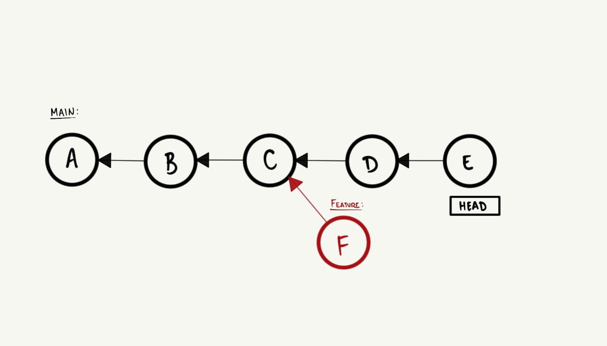
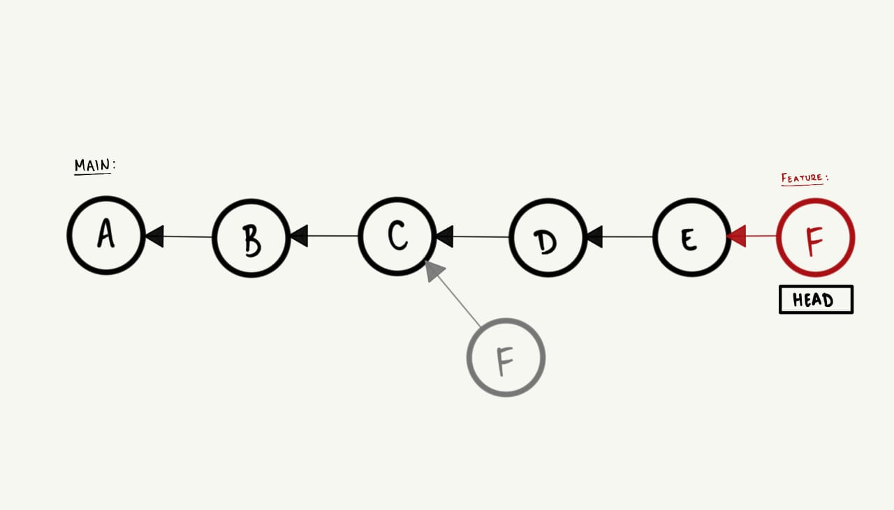
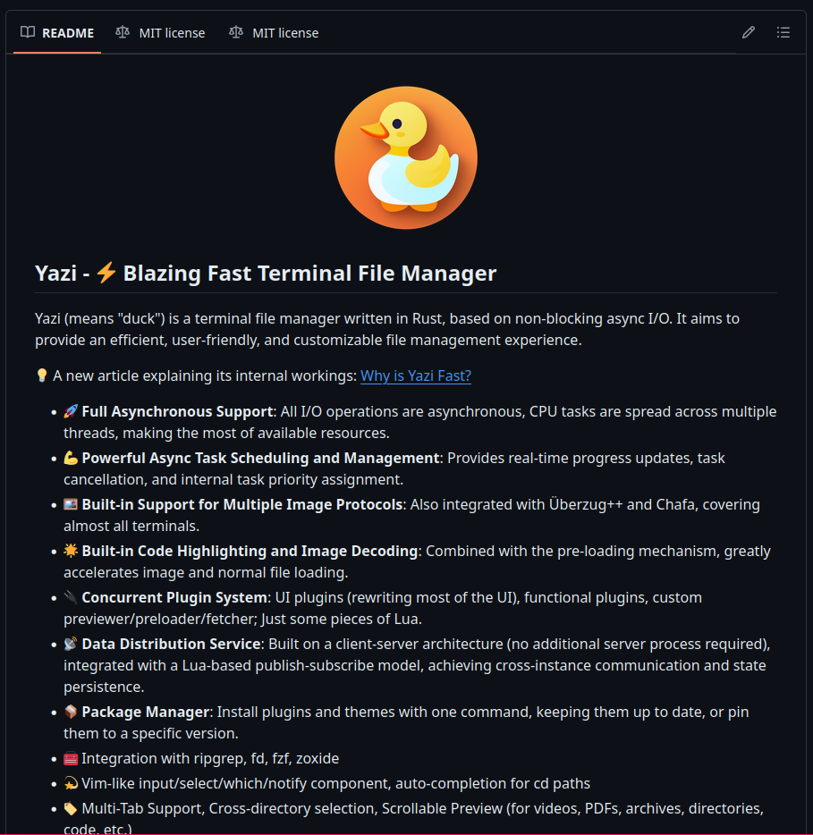

## GitHub e boas práticas de Git

Na aula anterior, começamos a trabalhar conceitos mais avançados de Git e Github, os quais permitem
trabalhar de forma colaborativa em projetos de software. Nesta aula, vamos explorar boas práticas envolvendo
esses conceitos além de descobrir algumas novas funcionalidades do Git.

### Pull requests

Primeiramente, gostaria de começar relembrando o que sabemos sobre branches e o workflow tradicional
do Git, onde temos uma branch principal e criamos branches paralelas para desenvolver novas funcionalidades
que são posteriormente integradas à branch principal. Num workflow tradicional, o processo de integração
ocorre através de merges, e esses merges são executados primeiro localmente e depois publicados no
repositório remoto. Entretanto, essa não é a única forma de integrar novas funcionalidades ao projeto,
ferramentas de hospedagem remota como o GitHub, por exemplo, permitem que os desenvolvedores criem o que
chamamos de pull requests.

O Pull request (Merge requests), ou PR, nada mais é que uma solicitação para que as alterações feitas em uma
branch sejam incorporadas a outra branch do projeto, e a grande vantagem do PR é que ele favorece
comunicação e transparência entre os desenvolvedores. Pois, quando um pull request é criado, dentro da
plataforma de hospedagem, os colaboradores são notificados e podem visualizar, comentar e revisar as
alterações feitas na branch.

O processo de pull request é muito simples e pode ser quebrado em alguns passos

1. Crie uma branch local e faça as alterações desejadas.
2. Publique a branch local no repositório remoto.
3. Acesse o repositório remoto e crie um pull request.
4. Peça para um mais colaboradores revisar seu código e faça alguma alteração se necessário.
5. Após aprovado e revisado, o pull request pode ser integrado ao projeto.
5. Delete a branch remota e local.

E algumas boas práticas envolvendo a criação de pull requests são:

1. Revisar bem seu código e pull request antes de submetê-lo.
2. Escrever um bom título e descrição concisa e com propósito claro.
3. Prover contexto e informações adicionais que possam ajudar o revisor.

## *Rebase*

Até então, vimos que o Git possui um comando chamado `merge` que é usado para integrar alterações de uma
branch, e que eu também posso fazer isso remotamente usando um pull request. Contudo, existe uma outra forma
de fazer isso que em muitos casos pode ser mais interessante, o `rebase`.

Assim, como o `merge` o `rebase` também explora o conceito de *source branch* e *target branch*, mas ao invés
de tentar conectar o histórico das duas branches, esse comando reaplica as alterações da *source branch* na
no topo da *target*. Visualizando isso, temos algo como:

- Primeiramente, imagine o seguinte histórico de commits:

  
   

- Agora, invés de criar um commit extra, quando usamos o comando `git rebase feature` todos os commits da branch `feature`
  são reaplicados no topo da branch `main`:

  
   

Assim como o *three-way merge* o `rebase` só funciona dessa forma se não houver conflitos entre as branches e o processo
de resolução de conflitos é análogo ao que vimos anteriormente. A grande vantagem do `rebase` é que ele mantém o histórico
de commits mais limpo e linear, o que pode ser a preferência de muitas equipes. Entretanto, apesar de ser intuitivamente
mais simples, o `rebase` é uma operação relativamente mais complexa que o `merge` e se não for usada com cuidado, pode lhe
causar muita dor de cabeça.

### Cuidados com o *rebase*

Como foi dito anteriormente, o `rebase` é uma operação mais complexa que o `merge` e deve ser usada com cuidado, esse
cuidado se deve ao fato de que o `rebase` é uma operação que reescreve o histórico de commits, e toda operação que faz isso
pode causar problemas chatos de resolver. Por isso, existe uma regrinha de ouro que podemos seguir para evitar esse
tipo de problema:

*Não "rebaseie" uma branch que outras pessoas estão usando*: Por exemplo, se você publicou uma branch no repositório
remoto, agora ela é de domínio público e outras pessoas podem estar trabalhando nela, se você fizer um rebase nessa branch
as pessoas vão ter que lidar com um histórico de commits completamente diferente e vai haver conflitos.

Para sempre evitar problemas envolvendo `rebase`, use-o se somente se:

- Você tem uma branch local que não foi publicada no repositório remoto.
- Você está trabalhando em uma branch local ou remota que você tem certeza que ninguém mais está usando.

## Stash

Saindo um pouco do assunto de branches e pull requests, gostaria de falar sobre um comando que pode ser muito útil em
algumas situações do dia-a-dia. O comando `git stash` é usado para salvar temporariamente e rapidamente as alterações que
você estava fazendo na sua branch local, permitindo que você possa mudar de branch ou fazer outras operações sem ter que
"commitar" ou descartar as alterações. Seu uso é extremamente simples e pode ser quebrado em alguns passos:

1. Salve as alterações que você estava fazendo com `git stash`, alternativamente, use a flag `-u` ou `-m` para salvar suas
suas alterações não rastreadas ou com mensagens, respectivamente.

2. Troque de branch ou faça as operações que você deseja.

3. Recupere as alterações salvas com `git stash pop [opcional-nome_do_stash]`, alternativamente, use `git stash apply [opcional-nome_do_stash]` para manter as alterações salvas no stash.

Alguns sub-comandos do `git stash` que também podem ser úteis são:

- `git stash list`: Lista todos os stashes salvos.
- `git stash drop`: Remove um stash específico.
- `git stash clear`: Remove todos os stashes salvos.
- `git stash show <nome_do_stash>`: Mostra as alterações salvas em um stash específico.

## Pout-Pourri

Para os propósitos do curso, finalmente exploramos tudo que nós do PET consideramos mais essencial e suficiente envolvendo
Linux, Git e Github, principalmente no âmbito de cursos de Computação na graduação. Claro que, naturalmente, existem
muitas outros conceitos, comandos, ferramentas, histórias e boas práticas que não foram abordadas, por isso, nestes últimos
tópicos, gostaria de lhe convidar a explorar alguns assuntos extras que podem ser interessantes para você.

### Changelog e README

Geralmente, quando começamos no Github e começamos a trabalhar em projetos, seguir outros desenvolvedores e ver o que eles
tão fazendo, é muito comum se depararmos com arquivos chamados `CHANGELOG.md` e `README.md` (inclusive, fizemos um deles
no último projeto). Por exemplo, no repositório do `yazi` (**github.com/sxyazi/yazi**):

 

O arquivo `README.md` é uma porta de entrada para o seu projeto, e também pode ser visto como a documentação principal do
projeto, nele, você pode colocar informações sobre o projeto, como instalar, como usar, quem são os colaboradores, etc.
Além disso, é o README que vai ser o primeiro arquivo que as pessoas vão ver quando acessarem o seu repositório, então,
como diz o ditado, a primeira impressão é a que fica.

Além do README, temos

### Perfil no GitHub

### Issues

### Forks

### Conventional Commits

## Projeto final pt.2
