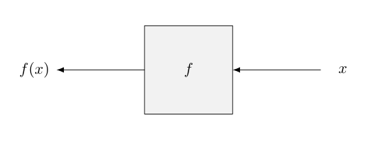

# {{ page.title }}

<div id="sumario" class="sumario-oldschool">
    <h1>Sumário</h1>
  <details>
    <summary><a href="#expandindo-a-ideia-de-comandos">Expandindo a ideia de comandos</a></summary>
      <ul>
        <li><a href="#aliases">Aliases</a></li>
        <li><a href="#vendo-um-comando-como-arquivo">Vendo um comando como arquivo</a></li>
      </ul>
    </details>
    <details>
    <summary><a href="#instalando-programas-no-linux">Instalando programas no Linux</a></summary>
      <ul>
        <li><a href="#manualmente">Manualmente</a></li>
        <li><a href="#gerenciadores-de-pacote">Gerenciadores de pacote</a></li>
      </ul>
    </details>
    <details>
    <summary><a href="#editores-de-texto">Editores de texto</a></summary>
      <ul>
          <li><a href="#escolhendo-um-editor-de-texto">Escolhendo um editor de texto</a></li>
      </ul>
    </details>
    <details>
    <summary><a href="#Shell-scripting">Shell scripting</a></summary>
      <ul>
        <li><a href="#por-quê-Shell-scripting">Por quê Shell scripting?</a></li>
        <li><a href="#a-primeira-linha-shebang">A primeira linha: #! (shebang)</a></li>
        <li><a href="#variáveis">Variáveis</a></li>
        <li><a href="#expansões">Expansões</a></li>
        <li><a href="#condicionais">Condicionais</a></li>
        <li><a href="#operadores-lógicos-no-Shell">Operadores lógicos no Shell</a></li>
        <li><a href="#funções">Funções</a></li>
        <li><a href="#loops">Loops</a></li>
      </ul>
    </details>
    <details>
      <summary><a href="#exercícios">Exercícios</a></summary>
    </details>
  <button class="toggle-button" id="toggle-button">
  
      Esconder Sumário
  
  </button>
  </div>

## Expandindo a ideia de comandos

### Aliases

No decorrer do dia anterior, espero que você tenha notado que a maioria dos comandos é uma abreviação de alguma
palavra em inglês, que passa uma ideia inicial do que determinado comando faz. Por exemplo: o `ls`
significa **L**i**S**t, o `cp` significa **C**o**P**y, o `rm` significa **R**e**M**ove e assim
por diante. Além disso, espero que você perceba que, se é algo que você usa com frequência, é inconveniente
digitar uma palavra longa toda vez que precisa invocar essa função. Esse mesmo sentimento
motivou os criadores do sistema a abreviar o nome dos comandos e a criar o que chamamos de *alias*.

Imagine que você usa o seguinte comando com frequência:

```sh
ls --color=auto --almost-all --classify -l --human-readable
```

E a maioria das vezes que você quer listar algo, você usa essa variação do `ls`. Se você não tem a capacidade
de digitar instantaneamente o que pensa, deve ser uma chatice ter que digitar isso
muitas vezes. Assim, o que podemos fazer é dar ao Shell um apelido para este comando. Então, em vez
de ter que digitar essa coisa toda, poderíamos apenas falar `meuls` e o Shell saber exatamente o que
fazer. A maneira de fazer isso é a seguinte:

```sh
alias meuls='ls --color=auto --almost-all --classify -l --human-readable'
```

Agora, durante essa sessão do Shell, sempre que digitarmos `meuls`, o Shell vai "expandir" esse apelido
e vai invocar seu real significado. E, de certa forma, conseguimos criar, com isso, um "novo comando".

### Vendo um comando como arquivo

Agora, uma reflexão interessante a se fazer é pensar como o Shell sabe quais são os apelidos que demos,
ou, até mesmo, o que é comando ou não.
[Relembrando quando estávamos começando a usar o Shell](/primeiroDia.md#comando-date-e-echo), nós não
podemos simplesmente digitar qualquer coisa aleatória como `balubslbeuaba` e esperar que ele entenda e
faça algo. Logo, o que o Shell faz é: armazenar, em uma variável, todos os lugares em que supostamente
existem programas que ele pode executar, e, quando você digita algo, ele vai procurar nesses lugares para ver se
de fato o que você digitou é um programa que ele pode executar.

Como os comandos/programas são simplesmente executáveis que estão em uma pasta "especial", nós podemos
perguntar onde eles estão com a seguinte linha:

```terminal
[user@hostname ~]$ whereis ls
ls: /usr/bin/ls /usr/share/man/man1/ls.1.gz
```

O comando `whereis` mostra a localização do executável de programas e a localização da sua página no `man`. Sabendo disso, você pode executar o `ls` ou qualquer outro comando passando o caminho inteiro para seu
executável, da mesma forma que você usaria normalmente:

```terminal
[user@hostname ~]$ /usr/bin/ls -l
```

O Shell utilizada a variável `$PATH` para saber onde procurar esses comandos, e nós podemos ver
o valor que ela armazena digitando o seguinte:

```terminal
[user@hostname ~]$ echo $PATH
/usr/local/bin:/usr/bin:/home/user/.local/share/bin
```

A saída pode parecer estranha, mas isso representa vários diretórios separados `:`, e o Shell vai em cada um
deles procurando o que você digitou no terminal.

## Instalando programas no Linux

### Manualmente

Agora que já sabemos o que de fato são os comandos que utilizamos no terminal e como o Shell busca esses
comandos, nós somos (finalmente) capazes de instalar qualquer programa no nosso computador. A ideia é
bem intuitiva:

1. Pegamos nosso executável pra colocar no `$PATH`:

    <div style="text-align: center;">
    
    </div>
    <br>

2. Queremos colocar o executável em dos diretórios do `$PATH`:

    <div style="text-align: center;">
    
    </div>
    <br>

3. **Colocamos ele `$PATH`**!!!:

    <div style="text-align: center;">
    
    </div>
    <br>

4. **E pronto!!!** Instalamos um programa!

É simples assim mesmo, mas trabalhar dessa maneira é um pouco desajeitado, pois existem programas que dependem
de outros arquivos para funcionar, como arquivos de configuração, de dados, elementos gráficos etc. Não podemos
simplesmente colocar o executável desse programa em um dos diretórios do `$PATH` e esperar que ocorra tudo
bem.

O que fazemos, então?

[Lembra dos symlinks?](/primeiroDia.md#links-simbólicos-sym-links). Podemos usá-los para colocar apenas
o atalho do executável no `PATH`, e aí, quando o Shell tentar rodar o programa, ele, na verdade, vai rodar o
original que está no diretório (de preferência bem acessível e fácil de gerenciar) que você quiser.

Mas, isso não significa que não existam peculiaridades de programa para programa. Às vezes, precisaremos
descompactar o arquivo que contém o executável do programa que baixamos da internet, ou, então, precisaremos
compilar o executável do programa, ou, por vezes, baixaremos apenas o executável... Enfim, varia de programa para
programa. O que precisa ser feito, na maioria das vezes, estará na documentação do que você quer
instalar.

### Gerenciadores de pacotes

Existem maneiras mais simples realizar instalações no seu sistema sem ter que fazer o download do programa na
internet, compilá-lo e adicioná-lo ao `PATH`, mas você vai precisar de permissões de superusuário para
conseguir fazer isso, a maneira, sem dúvidas, mais utilizada hoje em dia é utilizando o gerenciador de
pacote da sua distribuição Linux.

Esses gerenciadores de pacotes abstraem o processo de baixar da internet, instalar, atualizar (se futuramente houver atualização), pesquisar programas, e desinstalá-los, no alcance de um comando.
Essa, inclusive, é uma das grandes vantagens de usar o Linux no âmbito da computação, o processo de
configurar programas e suas depedências é muito fácil e você tem total autonomia para investigar e resolver
problemas que possam vir a aparecer.

Como mencionado anteriormente, o uso do gerenciador de pacotes vária de distribuição para distribuição, mas
vamos pegar como exemplo o gerenciador de pacotes da distruibuição que originou o Ubuntu, o Debian.

#### Exemplo com o uso do `apt`

Distribuições que nasceram do Debian, como o Ubuntu, usam o gerenciador de pacotes chamado `apt`, que nada
mais é do que um programa que vem instalado no computador, assim como todos os outros que vimos até agora.
Logo, podemos investigar seu uso usando o `man` como amigo.

##### TL;DR (To Long Didn't Read the manual)

Mas, se você estiver com preguiça de ler o `man`, aqui vai uma ajudinha:

- **Atualizar a lista de pacotes**: Este comando atualiza a lista de pacotes disponíveis a partir dos
repositórios configurados.

  ```bash
  sudo apt update
  ```

- **Instalar um pacote**: Para instalar um pacote, deve-se usar o sub-comando `install` seguido do nome do
pacote.

  ```bash
  sudo apt install nome-do-pacote
  ```

- **Remover um pacote**: Para remover um pacote, você usa o sub-comando `remove`.

  ```bash
  sudo apt remove nome-do-pacote
  ```

- **Atualizar todos os pacotes instalados**: Este comando atualiza todos os pacotes instalados para as
versões mais recentes disponíveis nos banco de dados do gerenciador.

  ```bash
  sudo apt upgrade
  ```

- **Pesquisar por um pacote**: Você pode usar o `search` para procurar pacotes específicos.

  ```bash
  apt search termo-de-busca
  ```

- **Limpar pacotes desnecessários**: Após uma atualização ou remoção de pacotes, você pode liberar espaço
removendo pacotes que não são mais necessários.

  ```bash
  sudo apt autoremove
  ```

Na maioria das distribuições, vão existir comandos ou combinações de comandos equivalentes aos do `apt` e
e conforme o uso esse processo de instalação, atualização e remoção se torna bem natural.

## Editores de texto

Recapitulando um pouco: exploramos bastante o Shell, diferentes maneiras de combinar comandos, e como abreviá-los. Nos exercícios do dia anterior, vocês escreveram em diversos arquivos determinadas sequências de comandos e, depois, foram capazes de realizar algumas ações. Neste tópico, vamos formalizar o que foi feito e expandir um pouco mais esse escopo.

Um Shell é uma linguagem de programação, mais específicamente uma linguagem de scripting assim como Python, Ruby e outras. Por ser uma linguagem de programação, um script em Shell nada mais é do que uma sequência de comandos que
existem no seu computador escritos num arquivo linha por linha, e, quando você executa o arquivo, seu sistema invoca o
Shell para interpretar o que ali foi escrito.

Com o que já vimos, somos plenamente capazes de escrever scripts simples, mas ainda falta dar mais alguns passos de
complexidade e aprender ferramentas que nos permitam trabalhar de maneira mais confortável, isto é, escrever em arquivos
sem depender de redirecionamento de streams (*stdin*, *stdout*, *stderr*) ou combinação de comandos. Para conseguir
fazer isso, precisamos escolher o nosso editor de texto favorito e colocar a mão na massa.

### Escolhendo um editor de texto

Provavelmente, seu sistema Linux já veio com alguns editores de texto para experimentar, uns mais difícies de aprender
do que outros, mas todos com suas próprias especialidades.

- [(neo)](https://neovim.io/)[**vim**](https://www.vim.org/) (**V**i **IM**proved): O favorito de muitos programadores mas, os que vamos      listar adiante este é, com certeza, o mais
    difícil para começar a usar. Entretanto, passado a curva de aprendizado inicial, é com certeza um dos editores de
    texto com a usabilidade mais prazerosa. A lógica de modos de teclado, configuração (isso se for o Neovim), e os atalhos
    pré-configurado tornam a escrita muito produtiva e divertida.

- [**vscode**](https://code.visualstudio.com/) (**V**isual **S**tudio **CODE**): Todo programador já usou ou vai usar, pelo menos alguma vez na vida, o
    Visual Studio Code. Ele é editor de texto da Microsoft, muito configurável e facílimo de começar usar, além de já vir com vários
    recursos que abstraem sua configuração e recursos para diferentes tipos de linguagem. Embora muitos vejam essa abstração como sua maior vantagem, também pode ser vista como como sua maior desvantagem, pois pode ser muito estressante solucionar problemas sem conseguir entender claramente a causa.

- [**GNU nano**](https://www.nano-editor.org/): Assim como o Vim, ele é um editor de texto leve que roda no terminal, porém, sua proposta é se manter simples.
    Não é possível configurar extensivamente esse editor, mas é muito fácil começar a usá-lo devido a sua
    interface informativa e pouca complexidade envolvendo o teclado.

Existem também muitos outros editores de texto populares. Aqui estão alguns deles:

- [**GNU emacs**](https://www.gnu.org/software/emacs/)
- [**Sublime Text**](https://www.gnu.org/software/emacs/)
- [**Zed**](https://zed.dev/)
- [**Notepad++**](https://notepad-plus-plus.org/downloads/)

## Shell scripting

[Recapitulando um pouco os exercícios do primeiro dia desse curso](/primeiroDia.md#exercícios), em diversos momentos, foi escrita uma sequência de comandos em um arquivo, que foi executada logo em seguida. Formalmente falando, o que você fez foi criar um script.

 A "linguagem Shell" é uma *linguagem de scripting*, e diferentemente de [*linguagens compiladas*](https://pt.wikipedia.org/wiki/Linguagem_compilada), como C,
C++, Java e Rust (🦀 rust mentioned!), que são interpretadas, traduzidas para uma representação interna, e
então executada, os comandos de *linguagens de scripting* como o Shell, "pulam" essa traduzação interna e
são diretamentes executados pelo interpretador.

A principal vantagem do uso de linguagens de scripting como "Shell", Python, Ruby e outras é que elas
geralmente trabalham num nível que se assemelha a linguagem humana, o que permite que você lide mais
facilmente com tarefas envolvendo arquivos, diretórios e programas. A principal desvantagem é que essas
linguagens tendem a ser menos eficientes, entretanto, a troca vale muito a pena para programas que não
precisam se preocupar com a perfomance.

### Por quê Shell scripting?

O primeiro motivo é que, até este ponto do curso, nós só trabalhamos com o Shell e escrevemos alguns scripts. Portanto, não faria sentido estudar Python ou outra linguagem de script. O segundo e principal motivo é que o Shell é universal entre os sistemas Unix, o que significa que, uma vez escrito com cuidado, ele pode ser executado em qualquer sistema Unix. Além disso, scripts de Shell são extremamente fáceis de escrever, e é bem sabido que são muito úteis para automatizar tarefas. Em pouco tempo, você terá em mãos uma ferramenta muito conveniente.

### A primeira linha: #! (shebang)

Como um script em Shell não é um programa compilado em linguagem de máquina, o nosso Kernel Linux não sabe
diretamente o que fazer com ele, então precisamos dizer ao sistema que programa vai ser responsável por
executar o nosso script. Para isso, usamos o `shebang`: uma linha que começa com `#!` seguido do
caminho absoluto do programa que vai executar e interpretar o script.

```sh
#!/bin/bash

# abobrinha bla bla bla ble
```

Em alguns casos, sem a `shebang`, seu Shell vai receber o erro de execução do kernel, e vai executar um
mecanismo que chamamos de *fallback*, e vai por conta própria escolher um interpretador para o seu script,
geralmente o `/bin/sh`, que é o Shell padrão do sistema. Para o Shell, é como se, ao receber esse erro, ele
dissesse: "Aha, não é um programa compilado, então vou interpretar isso como um script Shell"; e aí ele
executa o `/bin/sh` e passa o seu script como argumento para ele.

### Variáveis

Independentemente das linguagens de programação que você já estudou, provavelmente você já se deparou com o conceito de variável - um objeto capaz de reter e representar um valor ou expressão.
Inclusive, você já se deparou com algumas, lembra do `$PATH`? Pois bem, essa é uma das
variáveis que são compartilhadas entre todos os programas, as chamadas variáveis de ambiente, mas veremos
mais sobre isso no futuro.

Você pode criar e usar variáveis num script da seguintes maneira:

```sh
#!/bin/sh
fruta=banana
echo "$fruta"
# Vai imprimir "banana", aqui o Shell expande a variável
echo $fruta
# Também vai imprimir "banana", mas não é recomendado,
# pois o Shell pode usar certos processamentos e resultar em comportamente idesejado
echo '$fruta'
# Vai imprimir "$fruta", pois o Shell não vai expandir a variável
```

Além das variáveis especiais que já vimos, existem outras que são clássicas e muito utéis. Por exemplo, lembra
que alguns dos programas que você utilizou recebiam argumentos? Pois bem, existem variáveis que armazenam
os argumentos do último programa que você executou. Digamos que você tenha um script chamado
`omelhorscript.sh`, e você o executou:

```terminal
[user@hostname ~]$ ./omelhorscript.sh arg1 arg2 arg3 arg4 arg6 ... arg9
```

Quando ele começar a ser interpretado, seu sistema vai ter armazenado o valor de cada argumento passado
na última linha de comando, e você pode acessar esses valores pelas variáveis `$0` `$1`, `$2`, `$3`, ...,
`$9`.

```sh
#!/bin/sh
echo "O nome do script é $0"
# Esse comando vai imprimir "O nome do script é omelhorscript.sh"
echo "O primeiro argumento é $1"
# Esse comando vai imprimir "O primeiro argumento é arg1"
echo "O segundo argumento é $2"
# Esse comando vai imprimir "O segundo argumento é arg2"
# assim por diante
echo "O nono argumento é $9"
```

Alternativamente, para além do nono argumento e a partir do `$0`, a variável `$@` armazena todos os
argumentos passados:

Imagine o outro script `osegundomelhorscript.sh`:

- Você o executou com:

  ```terminal
  [user@hostname ~]$ ./osegundomelhorscript 1 2 3 4 5 6 7 8 9 10 11 12 13 14 15
  ```

- E a sua implementação é:

  ```sh
  #!/bin/sh
  echo "$@"
  # Vai imprimir "1 2 3 4 5 6 7 8 9 10 11 12 13 14 15"
  ```

Outra variável interessante é a `$PWD`, que armazena o diretório atual que o script está sendo executado.

### Expansões

#### Expansão de comandos e variáveis

O que observamos até agora sobre o Shell, em relação às variáveis, é o que chamamos de expansão. O símbolo $, precedendo o nome da variável, faz com que o Shell substitua o nome da variável pelo seu valor. No entanto, o Shell não se limita apenas a isso. Voltando ao exemplo da declaração de variáveis, podemos utilizar a sintaxe `$()` para expandir o valor produzido como saída por um determinado comando.

```sh
#!/bin/sh
# O valor armazenado pela variável `hoje` será o resultado do comando `date`
hoje=$(date)
echo "Hoje é $hoje"
```

#### Expansão aritmética

O Shell também é capaz de realizar a expansão de operações aritméticas, a sintaxe para isso é `$((expressão))`, um exemplo de uso seria:

```sh
#!/bin/sh
numero1=10
numero2=42
echo $((numero1 + numero2))
# Alternativamente
echo $((10 + 42))
```

---

#### Nota

Perceba que dentro de aspas que todas expansões não occorem dentro de apóstrofos, mas continuam funcionando
dentro de aspas duplas.

---

### Condicionais

### Operadores lógicos no Shell

[Lembra do *cliffhanger* da aula passada?](/primeiroDia.md#combinando-comandos-usando-pipelines), espero que você tenha percebido que lidar com
valores booleanos (`verdadeiro` e `false`) no Shell é conveniente para nós, para que possamos tomar decisões baseadas no resultados
de comandos. Porém, antes de lidarmos diretamentes com essas operações, precisamos entender o que são
status de saída, visto que eles definem se o programa executou normalmente ou houve algum problema.

#### Status de saída

Comandos no Linux, ao terminarem, retornam ao sistema um valor que chamamos de status de saída. Esse valor
é um inteiro que varia de 0 a 255, no qual, por convenção, 0 significa que o programa terminou com sucesso e
qualquer outro valor indica diferentes tipos de problema, especificados pelo comando. Na prática, podemos
visualizar isso da seguinte forma:

```terminal
[user@hostname ~]$ ls -d /usr/bin
/usr/bin
[user@hostname ~]$ echo $?
0
[user@hostname ~]$ ls -d /bin/usr
ls: cannot access '/bin/usr': No such file or directory
[user@hostname ~]$ echo $?
2
```

Esse `$?`, na verdade, é um váriavel especial do Shell, assim como o `$PATH`, que guarda o status de saída
do último comando. Na primeira vez que executamos o `ls`, o status de saída foi 0, indicando que o comando
terminou com sucesso, e, na segunda vez, o status de saída foi 2, indicando que houve algum tipo de problema.
Podemos investigar qual problema ocorreu, consultando o manual do `ls`, ou, se houver, lendo a mensagem de erro.

O Shell tem dois comandos extremamente simples que não fazem nada além de terminar com o status de saída
0 ou 1, o `true` e o `false`, respectivamente.

```terminal
[user@hostname ~]$ true
[user@hostname ~]$ echo $?
0
[user@hostname ~]$ false
[user@hostname ~]$ echo $?
1
```

#### Conjunção e disjunção

Os status de saída geralmente são usados para lidar com condicionais, ou seja, operações lógicas que
conhecemos como disjunção (`||`) e conjunção (`&&`). A disjunção ou o `e` no Português, vai ser avaliada
como verdadeira se os dois operandos forem verdadeiros, e a conjunção ou o `ou` no português, é vai ser
verdadeira se pelo menos um dos operandos for verdadeiro. Podemos visualizar isso como:

```sh
false || echo "Opa, vou imprimir isso"
# Como o primeiro é falso, o segundo vai ser avaliado

true || echo "Não vou ser imprimido"
# Como o primeiro é verdadeiro, o segundo não vai ser avaliado

true && echo "Things went well"
# Como o primeiro é verdadeiro, o segundo vai ser avaliado

false && echo "Will not be printed"
# Como o primeiro é falso, não preciso nem avaliar o segundo

true ; echo "Vai sempre rodar"
# De extra, o `;` é um separador de comandos, logo o segundo comando vai ser executado,
# independentemente do status do primeiro

false ; echo "Sou imbatível"
```

O que o `&&` e o `||` fazem é o que chamamos de curto circuito: baseado na primeira expressão, o interpretador
decide se vai avaliar o resto ou não.

#### if-elif-else-fi

Além das variáveis, também temos as condicionais, que funcionam de um jeito um pouco diferente. Os
valores booleanos, ou seja, `true` e `false`, são representados pelos códigos de saída de cada programa,
como visto no tópico de [operadores lógicos](/primeiroDia.md#operadores-lógicos-no-Shell). Consequementemente, o jeito mais imediato de usar condicionais é com os *if statements*, e a sintaxe para
isso é:

```sh
if  comando ; then
  # código
fi
```

(`fi` é `if` de trás pra frente, e é o comando que fecha o bloco de código do `if`)

O código só será executado se o `comando` tiver 0 como código de saída, e você pode adicionar um `else`,
que é executado se o código de saída for diferente de 0.

```sh
if comando ; then
  # código
else
  # código
fi
```

Ná prática, nós podemos fazer algo como:

```sh
#!/bin/sh
# Tue é a abreviação de Tuesday, que é terça em inglês
if date | grep -q "Tue"; then
  echo "Hoje é terça"
else
  echo "Hoje não é terça"
fi
```

Se o `grep` encontrar a expressão `True` no output do comando `date`, o código de saída do `grep` vai ser 0.
Logo o dia de hoje será terça, caso contrário, não será.

Além disso, temos o `elif`, uma abreviação de `else if`, e é utilizado para adicionar mais condições
a um `if`.

#### Expressões lógicas

Outra forma de usar condicionais é usando o comando `test`, que avalia expressões lógicas e retorna 0 se a
expressão for verdadeira e 1 se for falsa. A sintaxe é a seguinte:

```sh
#!/bin/sh
if test expressão ; then
  # código
fi
```

Naturalmente, as opções que o `test` aceita imitam as expressões que conhecemos na matemática e em outras
linguagens de programação, por exemplo, o `-eq` representa a igualdade entre dois números
`(1 -eq 0` ≅ `1 == 0`), o `-lt` representa a desigualdade entre dois números (`1 -lt 0` ≅ `1 < 0`), e assim
por diante. Você pode verificar todas usando o manual (`man test`).

Alternativamente, os `[]` servem como um alias para o `test`

```sh
#!/bin/sh
if [ expressão ] ; then
  # código
fi
```

Algumas das expressões lógicas mais utilizadas são:

- **Para inteiros e strings:**

  | Operador   | Verdade se..    |
  |--------------- | --------------- |
  | `string`    | `string` não é vazia. |
  | `s1 = s2`   | a strings `s1` e `s2` são iguais.   |
  | `s1 != s2`   | as string `s1` e `s2` não são iguais.   |
  | `n1 -eq n2`   | `n1` e `n2` são iguais.    |
  | `n1 -gt n2`   | `n1` é maior que `n2`.    |
  | `n1 -lt n2`   | `n1` é menor que `n2`.    |
  | `n1 -ge n2`  | `n1` é maior ou igual a `n2`. |  
  | `n1 -le n2`  | `n1` é menor ou igual a `n2`. |  

- **Para arquivos e diretórios:**

  | Operador   | Verdade se    |
  |--------------- | --------------- |
  | `-e arquivo`   | O `arquivo` existe.   |
  | `-d arquivo`   | O `arquivo` é um diretório.   |
  | `-f arquivo`   | O `arquivo` é um arquivo regular.   |
  | `-r arquivo`   | O `arquivo` tem permissão de leitura.   |
  | `-w arquivo`   | O `arquivo` tem permissão de escrita.   |
  | `-x arquivo`   | O `arquivo` tem permissão de execução.   |
  | `-s arquivo`   | O `arquivo` não está vazio.   |
  | `-L arquivo`   | O `arquivo` é um link simbólico.   |

Cada teste pode ser negado com um `!` antes do operador. Por exemplo: `! -e arquivo` é verdadeiro se o não
existe. Vamos experimentar um pouco com isso:

```sh
#!/bin/sh
if [ -f "$1" ]; then 
  echo "O arquivo $1 é um arquivo regular"
elif [ -d "$1" ]; then
  echo "O arquivo $1 é um diretório"
else
  echo "O arquivo $1 não é um arquivo regular nem um diretório"
fi
```

Por ser também um comando, podemos combinar o `test` com outras instâncias de `test` usando os operadores
que já conhecemos:

- *Usando a conjunção (`&&`):*

  ```sh
  #!/bin/sh
  if [ -f "$1" ] && [ -r "$1" ]; then
    echo "O arquivo $1 é um arquivo regular e tem permissão de leitura"
  fi
  ```

- Usando a disjunção (`||`):

  ```sh
  #!/bin/sh
  if [ -f "$1" ] || [ -d "$1" ]; then
    echo "O arquivo $1 é um arquivo regular ou um diretório"
  fi
  ```

---

#### Nota

Na comparação de strings existe uma certa convenção, pois, se o valor da string for vazio, o `test` pode
ficar confuso, especialmente se você não usar aspas. Por exemplo:

```sh
#!/bin/sh
string=""
test $string = "banana"; echo $?
# O seu Shell vai retornar um error, pois o comando `test` vai receber 3 argumentos
```

Então, além de sempre ser recomendado usar aspas, existe uma convenção de prefixar uma string (conjunto de caracteres) com "X"
durante a comparação, para que esse tipo de erro aconteça, por exemplo:

```sh
#!/bin/sh
string=""
test "X$string" = "Xbanana"; echo $?
# Note a diferença no status de saída
```

Agora, a comparação não vai resultar em um erro, pois o `test` vai receber a quantidade certa de argumentos

---

### Funções

Se você está começando agora na programação, provavelmente ainda não deve estar completamente familiarizado
com o conceito de funções, mas com certeza é algo que você já usou muitas vezes sem perceber. Quando
você invoca um comando no Shell, seja com ou sem argumentos, você sempre espera uma determinada saída ou
resultado. E é exatamente esse o comportamento de uma função, exceto que, no contexto de linguagem de programação,
geralmente nos referimos a funções como blocos de código independentes que realizam uma tarefa específica
quando são invocados.

#### Black boxes

Tanto na programação quanto na matemática, funções são enxergadas como caixas pretas, visto que não
precisamos saber como elas funcionam, apenas o que elas recebem como entrada e o que elas retornam como
saída.

Quando definimos uma função como uma *black box*, precisamos dizer qual é seu nome, que tipo
de argumento ela recebe, e que tipo de argumento ela retorna. Por exemplo: Se $f$ é função e $x$ é um argumento
que ela aceita, a aplicação de $f$ em $x$ é representada por $f(x)$, e o resultado é o valor que ela "retorna".

<div style="text-align: center;">

</div>
<br>

- Imagem retirada do livro *Matemática Funcional para Computação*, Thanos Tsouanas. Disponível em:
<https://www.tsouanas.org/fmcbook/>

#### Funções no Shell

Tradicionalmente, para conseguirmos usar uma função, precisamos defini-la, seja no início do script
ou em um arquivo separado. A sintaxe para definir e usar uma função é a seguinte:

```sh
#!/bin/sh
# Definição
funcao() {
  # código
}

# Uso
funcao
```

Alguns exemplos de funções seriam:

```sh
#!/bin/sh
# Esta função recebe como argumento algum nome, 
# cria um diretório com esse nome e muda para ele.
mcd() {
  mkdir -p "$1"
  cd "$1"
  # O retorno de funções do Shell sempre são seu código de saída,
  return "$?"
  # Essencialmente podemos emitir esse campo, ou usar um código de saída personalizado
}

# Esta função recebe como argumento um nome de arquivo,
# verifica se o arquivo existe ou não e imprime uma mensagem
regf() {
  test -f "$1" && echo "$1 existe" || echo "$1 não existe"
}
```

Como não invocamos essas funçãos no código, nada vai acontecer. Mas podemos "sourcear" o arquivo que as
contém e invocá-las.

- "Sourceamos" com:

  ```terminal
  [user@hostname ~]$ source minhas_funções.sh
  ```

- E invocamos tradicionalmente:
  
  ```terminal
  [user@hostname ~]$ mcd meudiretório
  [user@hostname meudiretório]$
  ```

### Loops

Outro recurso muito característico de linguagens de programação no geral são os *loops*: blocos de
códigos que são executados repetidamente até que uma condição de parada seja satisfeita (ou não).

Essencialmente, no Shell, existem 3 tipos de loop, mas veremos apenas 2, o `for` e o `while`.

#### `while` loop

O `while` é um loop que executa um bloco de código enquanto uma condição for verdadeira, por exemplo,  
voltando para os nossos exemplos de [expressões lógicas](#expressões-lógicas), poderiamos criar um `while` da seguinte maneira:

```sh
  #!/bin/sh
  while [ -f "$1" ] && [ -r "$1" ]; do
    echo "O arquivo $1 é um arquivo regular e tem permissão de leitura"
  done
```

Se, por acaso, o arquivo que passamos como argumento for regular e tiver permissão de leitura, o bloco de
código vai ser executado até que se altere o arquivo ou a permissão dele.

#### `break`

O `break` é um comando que geralmente é utilizado dentro de loops para evitar que o loop continue
infinitamente, e evitar casos como o anterior.

Aproveitando o exemplo anterior, poderiamos usar o `break` para sair do loop caso a condição seja
satisfeita.

```sh
  #!/bin/sh
  while [ -f "$1" ] && [ -r "$1" ]; do
    echo "O arquivo $1 é um arquivo regular e tem permissão de leitura"
    break
  done
```

(Note que o bloco de codigo dentro do loop só vai ser executado uma vez).

#### `for` loop

O `for` itera sobre uma lista de elementos, e executa um bloco de código para cada elemento da lista. Por
exemplo, poderiamos usar o `for` para iterar sobre uma lista de argumentos de comando:

```sh
#!/bin/sh
for argumento in "$@"; do
  echo "O argumento é $argumento"
done
```

Além disso, podemos usar o `for` para iterar sobre arquivos e diretórios. Por exemplo, para listar todos os
arquivos do diretório atual:

```sh
for arquivo in *; do
  echo "$arquivo"
done
```

Alternativamente, se quisermos listar todos os arquivos de um diretório específico, a partir de um `for`:

```sh
for arquivo in /caminho/para/diretório/*; do
  echo "$arquivo"
done
```

## Exercícios

### Exercício 1

Instale o Yazi 🦆!

Baixe o arquivo compactado com o binário [daqui](https://github.com/sxyazi/yazi/releases), escolha a
versão `yazi-x86_64-unknown-linux-gnu.zip` e faça o que for necessário para que o programa `yazi` seja
executável em qualquer lugar do seu sistema.

- Para descompactar, use o comando `unzip`.

Como resolução, descreva os passos que você fez para instalar o programa em um arquivo de texto, por exemplo: `ans0201.txt`.

### Exercício 2

Instale o Discord 🎮!

Baixe o arquivo `.tar.gz` do [site oficial](https://discord.com/), investigue o comando `tar` com `man tar`
e faça o que for necessário para que o programa `discord` seja executável em qualquer lugar do seu sistema.

Como resolução, descreva os passos que você fez para instalar o programa em um arquivo de texto, por exemplo: `ans0202.txt`.

### Exercício 3

Investigue o `ls` com `man ls`, e crie uma variação do comando (alias) `ls` com suas opções que lista os arquivos
da seguinte maneira:

- Lista dotfiles
- Os tamanhos são listados de forma humanamente legível.
- Os arquivos são ordenados por ordem de modificação.
- A saída é colorida.

Um exemplo de saída seria:

```terminal
 -rw-r--r--   1 user group 1.1M Jan 14 09:53 baz
 drwxr-xr-x   5 user group  160 Jan 14 09:53 .
 -rw-r--r--   1 user group  514 Jan 14 06:42 bar
 -rw-r--r--   1 user group 106M Jan 13 12:12 foo
 drwx------+ 47 user group 1.5K Jan 12 18:08 ..
```

Como resolução será aceita a linha de comando que você usou para criar o alias em formato de arquivo
de texto.

### Exercício 4

Faça um script para backup!

O seu programa deve receber apenas um argumento: o nome do arquivo ou diretório que você quer fazer backup.

```terminal
bak.sh FILE 
```

Exemplo de uso:

```terminal
[user@hostname ~]$ ls
Downloads Documents Pictures
[user@hostname ~]$ sh bak.sh Downloads
[user@hostname ~]$ ls
Downloads Downloads.bak Documents Pictures
```

Se o argumento passado for um diretório, todos os seus arquivos e sub-diretórios também devem sofrer backup.
Caso contrário, apenas o arquivo passado como argumento deve ser copiado.

Além disso, o arquivo gerado deve ter a extensão `.bak` e deve ser salvo no mesmo diretório que o arquivo.

Será aceito como resolução o arquivo de código que você usou para implementar o programa.

### Exercício 5

Escreva funções `sh`, chamadas `marco` e `polo` que fazem o seguinte:

- Toda vez que você chamar a função `marco`, ela salva o diretório atual de alguma forma.
- Toda vez que você chamar a função `polo`, ela muda para o diretório salvo pela função `marco`.

Lembre-se de usar o `source` para recarregar as definições para seu Shell.

Como resolução, aceitaremos o(s) arquivo(s) de código que você usou para implementar as funções

### Exercício 6

Crie um programa para ser usado na linha de comando que permita os usuários realizar operações básicas,
como criar, listar e excluir arquivos e diretórios. O aplicativo deve aceitar opções e argumentos para
especificar a ação a ser realizada.

Supondo que `$` é o prompt do seu Shell, o programa deve funcionar da seguinte maneira:

```terminal
$ ./fm
Usage: ./fm [OPTION]... FILE...

Options:
  -h, --help     Show this help message and exit
  -l, --list     List all files in the current directory
  -c, --create   Create a new file
  -d, --delete   Delete a file
```

Note que seu programa pode receber múltiplos arquivos e opções, além de que a ordem dos argumentos não deve
importar.

- Dica: Use o caminho do `bash` no shebang, para ter acesso ao operador `+=` que concatena elementos em um array.

Será aceito como resolução, o arquivo de código que você usou para implementar o programa
---


